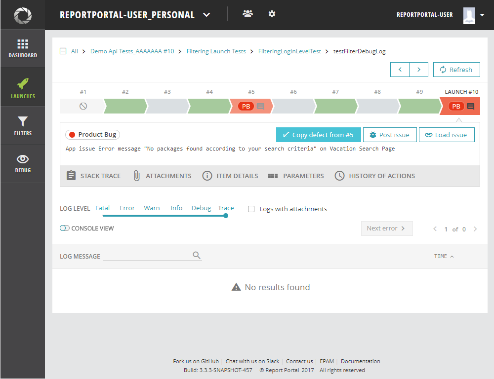
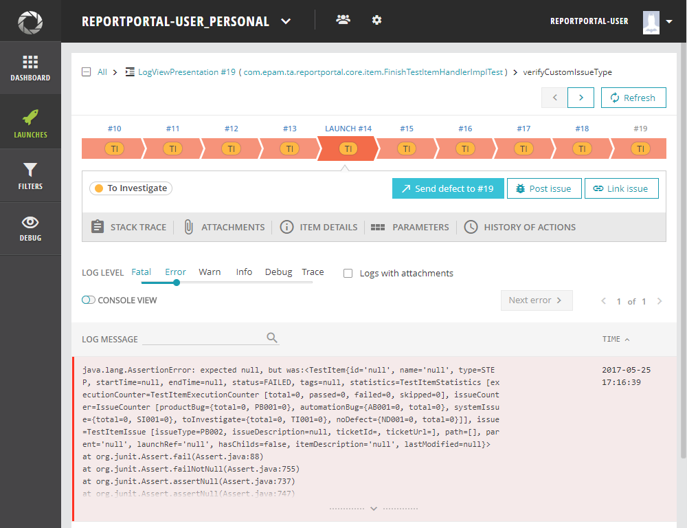

# Copy results from a previous run

In case you do not want to use Auto-Analyzer we provide you a possibility to get results from previous runs.  So that you can set for a test item: Defect type, linked bug, and comment from the previous run at once. For that, you can hit a button "Copy defect from #" in the last test item and copy a defect from the last but one test item with defect type.

]

or hit a button "Send defect to #" from the not the last items and send defect to the last test item ( if it can have a defect type).

]
