# Manual Analysis

Manual Analysis is presented on ReportPortal by “Make decision” modal. 

## “Make decision” modal redesign 
 
Redesign of the “Make decision” modal was implemented in version 5.7. This feature helps to sort out auto tests and decide: What is the problem? How can it be marked? Is it required to post issue or link issue? It became easier to use this functionality after the redesign.  
 
The “Make decision” modal can be opened in three ways: 
 
1) from the Step level 

[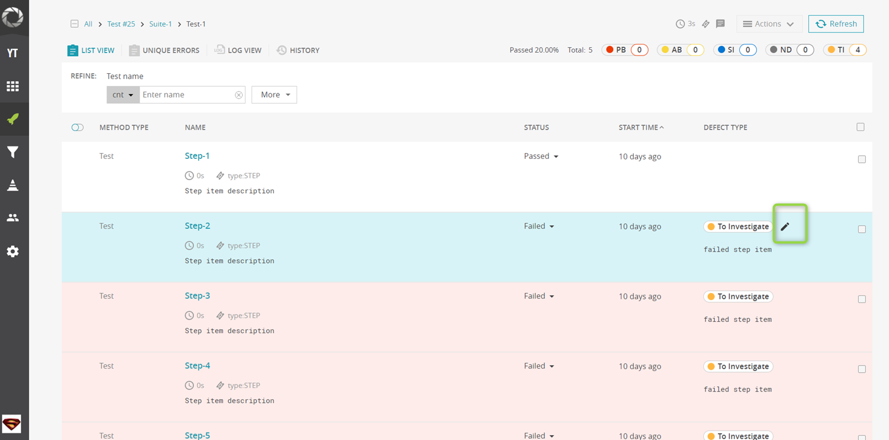](img/ManualAnalysis/make_decision1.png)

2) via Actions

[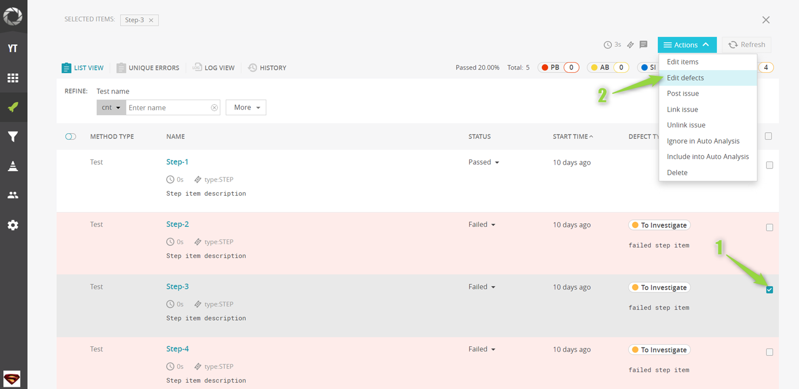](img/ManualAnalysis/make_decision2.png)

3) from the Log level 

[ 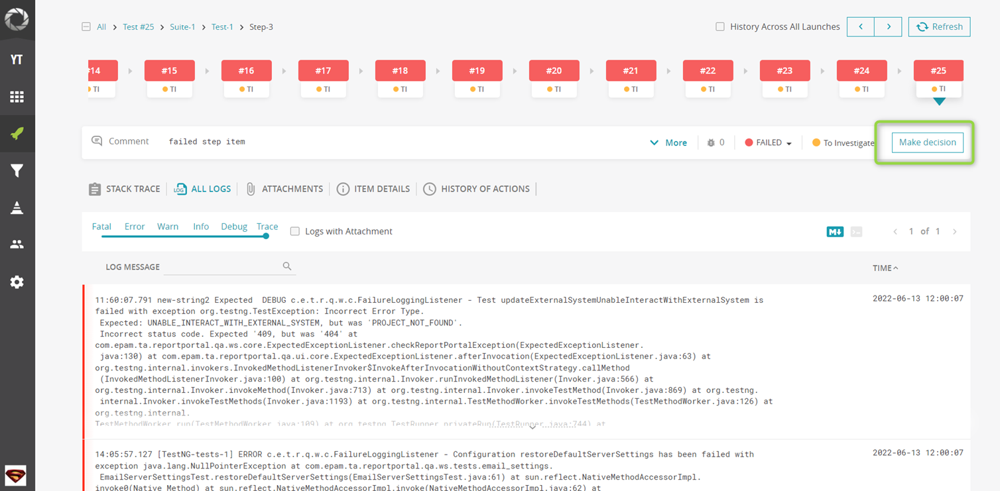 ](img/ManualAnalysis/make_decision3.png)

## “Execution to change” section

**“Execution to change”** section is displayed at the top left of the “Make decision” modal. It includes Step name, current defect type. Also it can have a log, a comment, a link to a Bug Tracking System (BTS), a label (AA, PA, Ignore AA) if exist. You can expand logs to understand why this step was failed.

[ 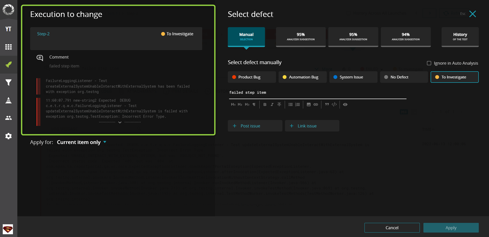 ](img/ManualAnalysis/make_decision4.png)

## How to set a defect type and type a comment

**“Select defect”** section is displayed at the top right of the “Make decision” modal. It includes “Manual selection”, “Analyzer suggestions”, “History of the test”.

[ 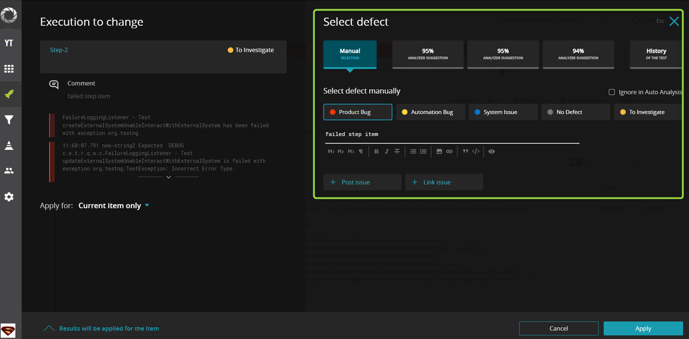 ](img/ManualAnalysis/make_decision5.png)

You can **select a defect type and type a comment manually**. Selected defect type and added comment will be applied to the current item (there is also a possibility to apply them to other items – please, have a look at “Apply for” section).

[ 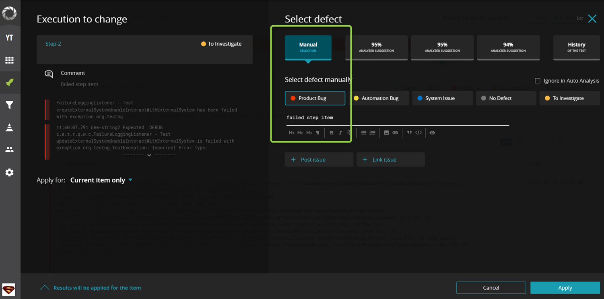 ](img/ManualAnalysis/make_decision6.png)

## How to use “Analyzer suggestions”

You also can select any step from the **“Analyzer suggestions”** with a similar log. Similar log is marked with a red asterisk. Then the defect type, the comment and linked BTS ticket (if exist) of the suggested step will be applied to the current item (there is also a possibility to apply them to other items – please, have a look at “Apply for” section).

[ 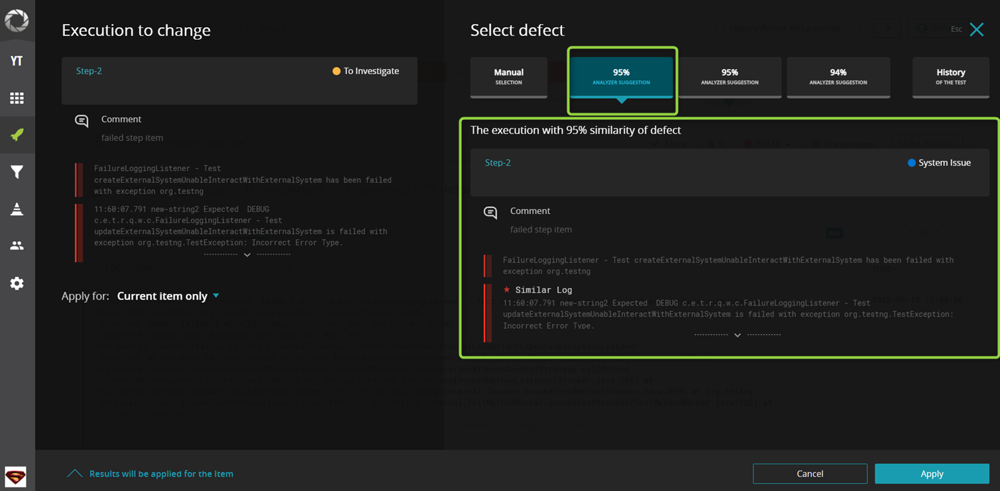 ](img/ManualAnalysis/make_decision7.png)

## “History of the test” section

You can see the **“History of the test”** – which defect type this step had in previous runs. You can select any item from the “History of the test”. Then the defect type, the comment and linked BTS ticket (if exist) of the suggested step will be applied to the current item (there is also a possibility to apply them to other items – please, have a look at “Apply for” section).

[ 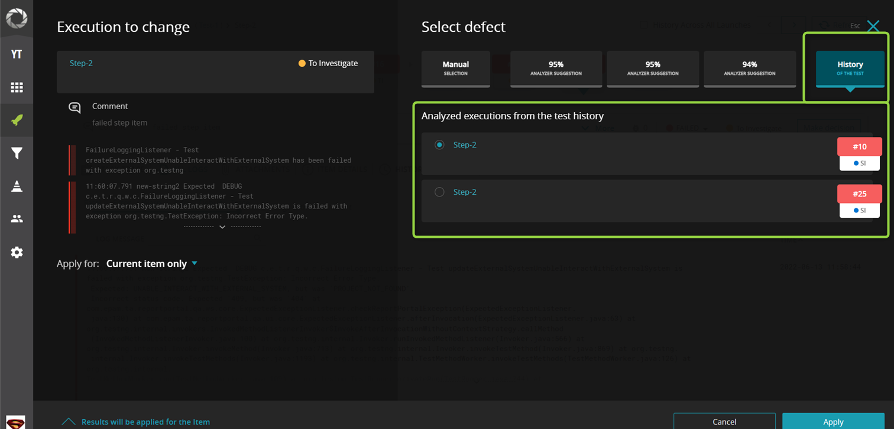 ](img/ManualAnalysis/make_decision8.png)

## How to select other steps for analysis

The “Make decision” modal works not only with the current step. This feature allows to select other steps with “To Investigate” defect type which can be changed as well. For that, please, expand the **“Apply for”** section and select the needed option.

[ 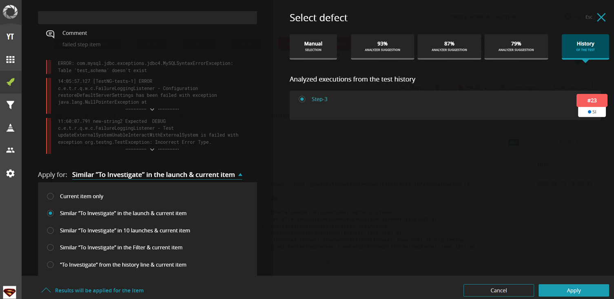 ](img/ManualAnalysis/make_decision9.png)

The **“Results will be applied for”** message is displayed at the bottom after selection. This section was added in version 5.7.

[ 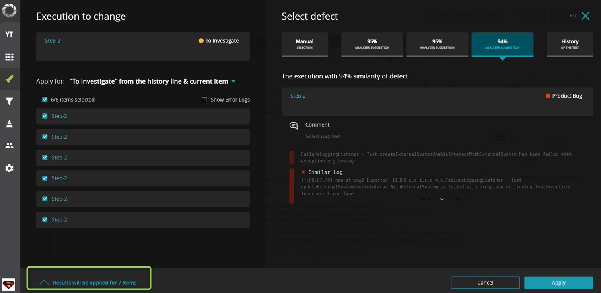 ](img/ManualAnalysis/make_decision10.png)

Now you can view all changes before applying. Expand the “Results will be applied for” section to see information about changes. You should click **“Apply”** button to apply selected changes. 

[ 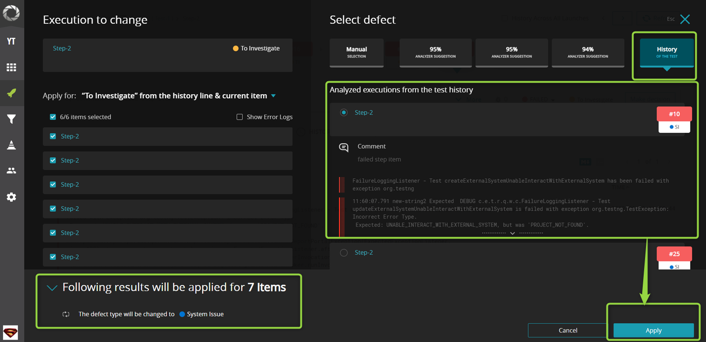 ](img/ManualAnalysis/make_decision11.png)

## Bulk update

There is also a possibility for Bulk update, when the changes are applied to all selected test items.

[ 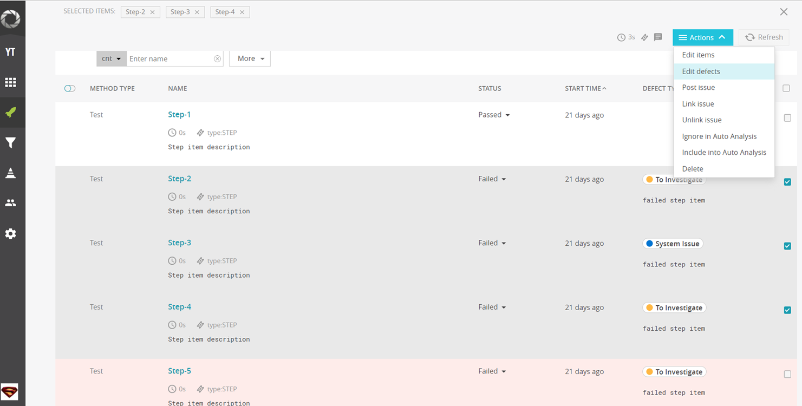 ](img/ManualAnalysis/make_decision12.png)

[ 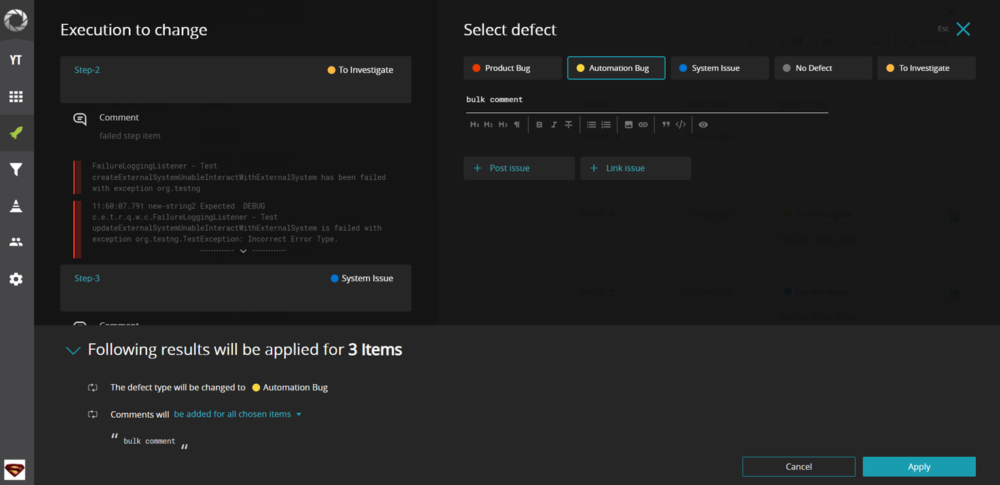 ](img/ManualAnalysis/make_decision13.png)

As you can see, “Make decision” modal is a time-saving tool for engineers.
