# Unique Error Analysis

You can look at the problem of falling test cases from different points of view: do a qualitative analysis (passing rate – How many tests have failed?) and do a quantitative analysis (Why have they failed?). For example, if 1000 test cases are failed, then

1. they could fail for the same reason

2. they could fail for various reasons

While failed tests allow you to understand what is broken, “Unique Error analysis” functionality implemented in version 5.7 will show you why it broke. The main advantage of this solution is that a list of all unique errors of the launch is presented in one place. Moreover, the system automatically groups tests by the same errors: when you expand some error, you see a list of steps where it occurred.

**“Unique error auto-analysis”** is set ON by default.

## “Include/exclude numbers” settings

There are 2 settings: “include/exclude numbers” – it depends if you decide that numbers in error logs have significant value for analysis or not.

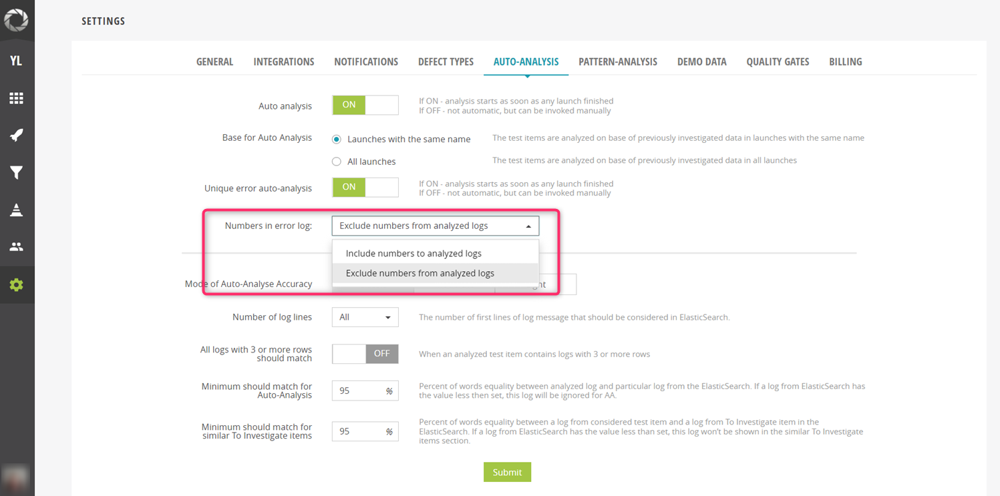

Now, Unique error auto-analysis will be started after a launch has been finished. 
 
To see the list of “Unique errors” for the launch, open any item level in the launch and click **“Unique errors”** tab. 

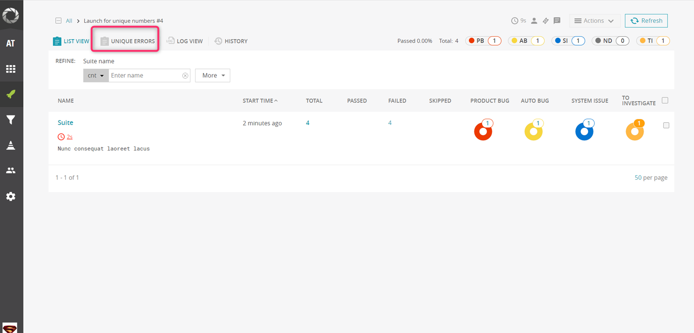

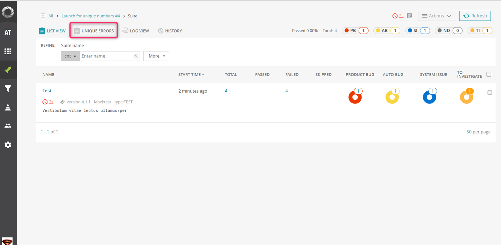

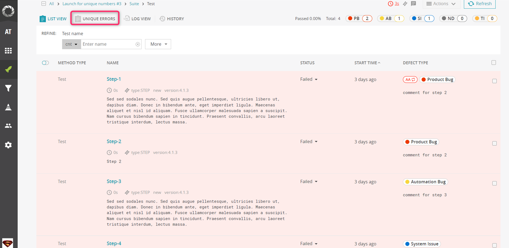

Finally, you can see the list of “Unique errors”.

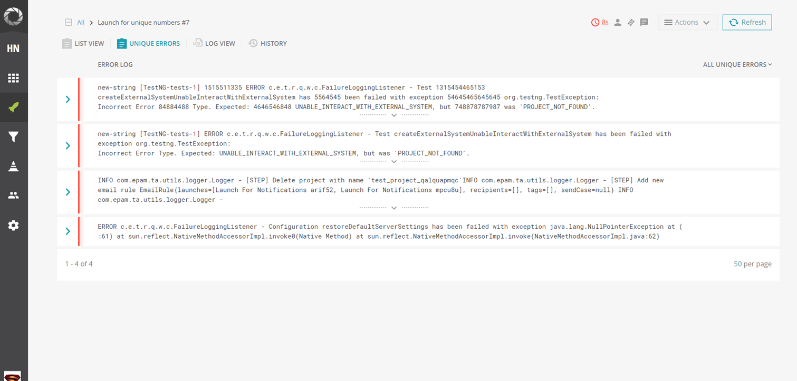

There you can see a list with groups of error logs. You can expand a group to check what tests belong to the same one and it could give you a hint during error analysis and defects assigning. The groups are formed based on unique error logs, some small error logs can be merged and displayed as one error.

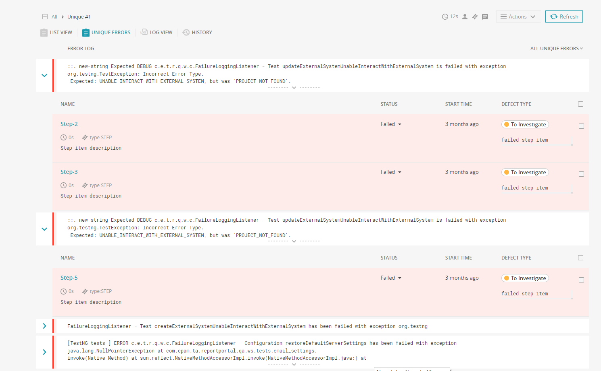

## How to run “Unique error analysis” manually

>**NOTE: **
You can also run “Unique error analysis” manually from any item level in case auto analysis is set OFF. Please, follow the steps below: 

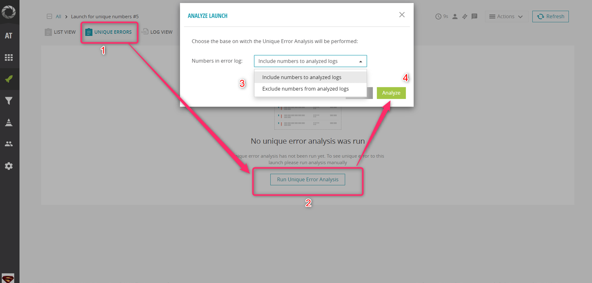

You can also run “Unique Error analysis” from the menu next to a particular launch.

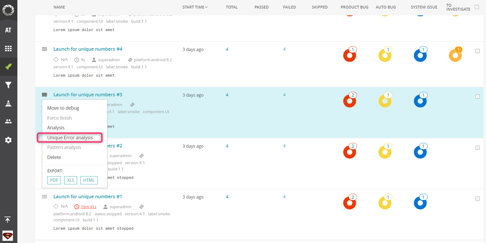

## Examples with “Include/exclude numbers” settings

Let’s consider some examples with the same Unique Errors but with different include/exclude numbers settings.
 
We have 2 errors with identical text, but the difference is numeric value in the first error. 
 
1. An example with **“Include numbers to analyzed logs”** setting. Error with numeric value is displayed:

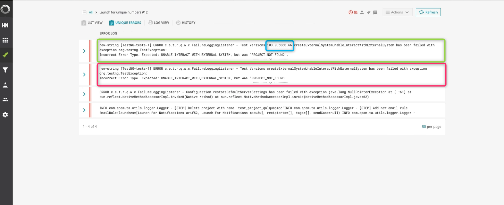

2. An example with **“Exclude numbers from analyzed logs”** setting. As you can see, error with numeric value is not displayed:

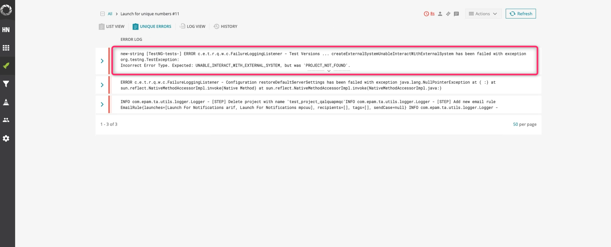

## How to get ML suggestions for the group of steps

In addition, there is a possibility to get **ML suggestions** for the group of steps. It speeds up the process of analyzing failed tests and assigning defect types by several times.

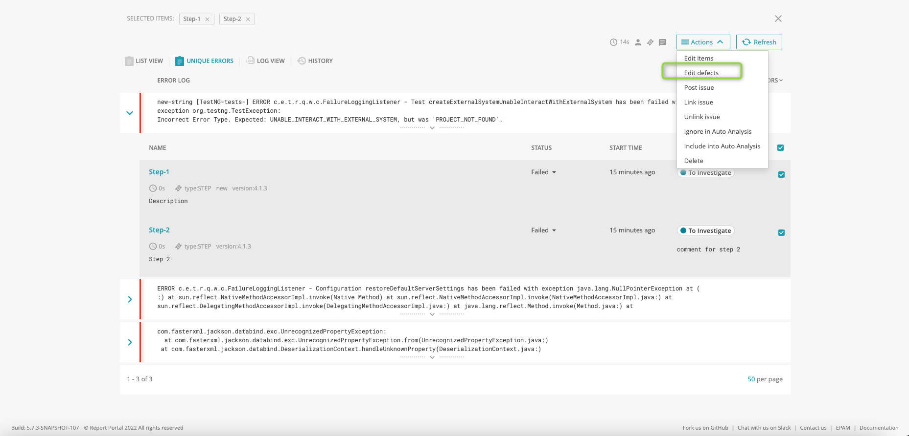

Also, the new Quality Gates rule – [“New Errors”](/quality-gates/QualityRulesConfiguration#new-errors-in-the-run) – was implemented based on the “Unique Error analysis” functionality. This rule helps to identify if there are new unique errors in the current launch by comparing it to another specified launch.

To summarize, ReportPortal got the following benefits thanks to the “Unique Error analysis” functionality:

1. a list of unique errors for the launch with grouping,
2. facilitating tests results analysis,
3. ML suggestions for a group of steps,
4. new Quality Gates rule.

This way you can easily sort out the failures based on the unique errors found.