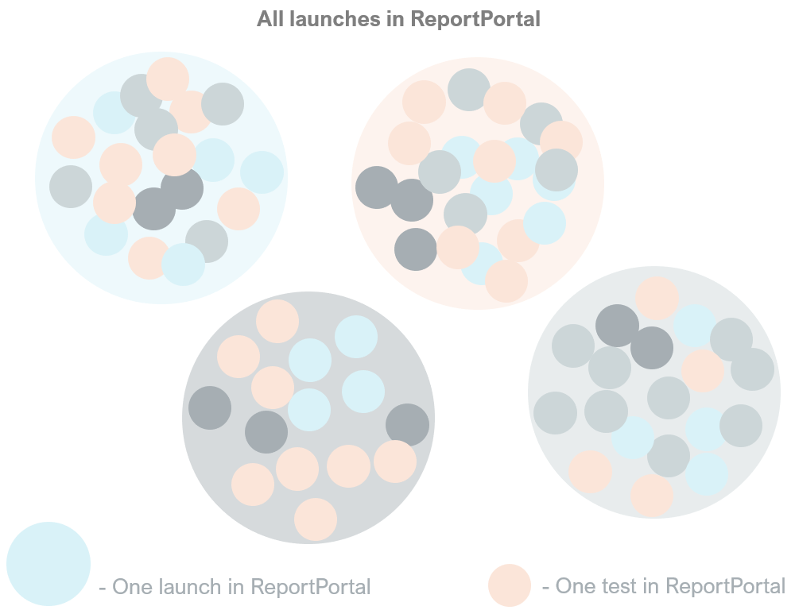
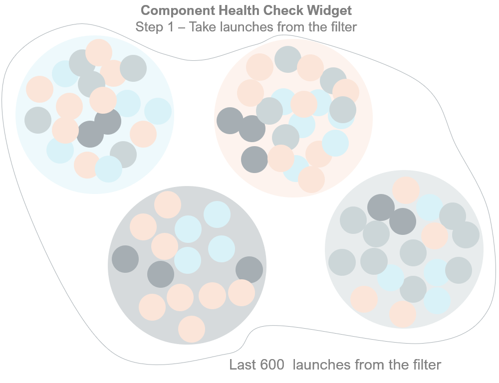
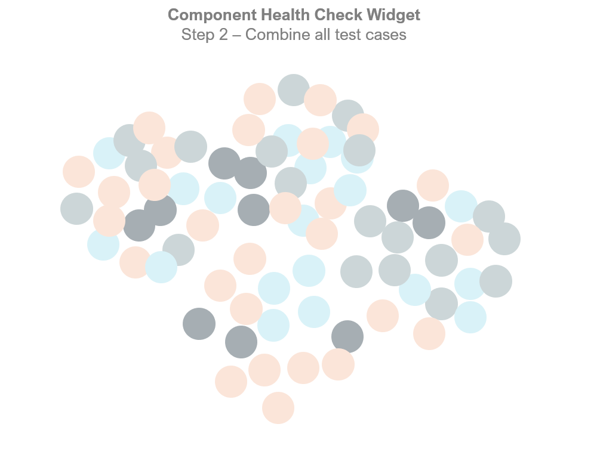
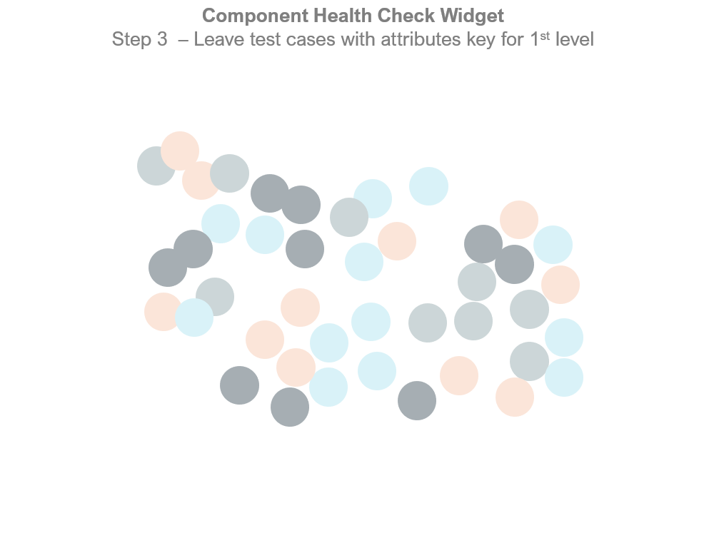
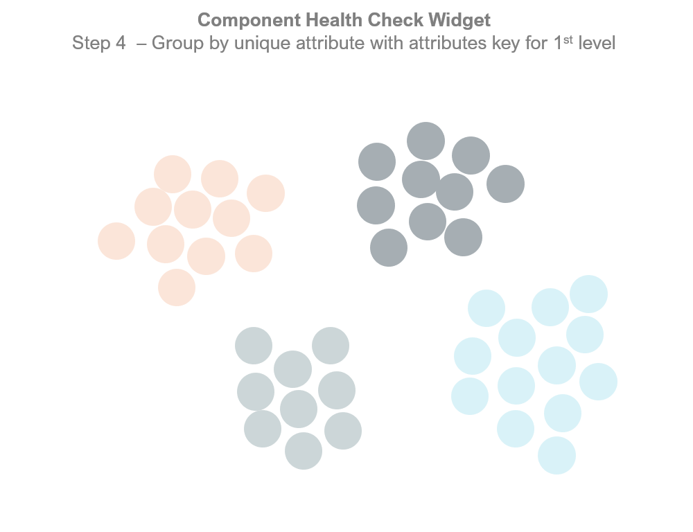
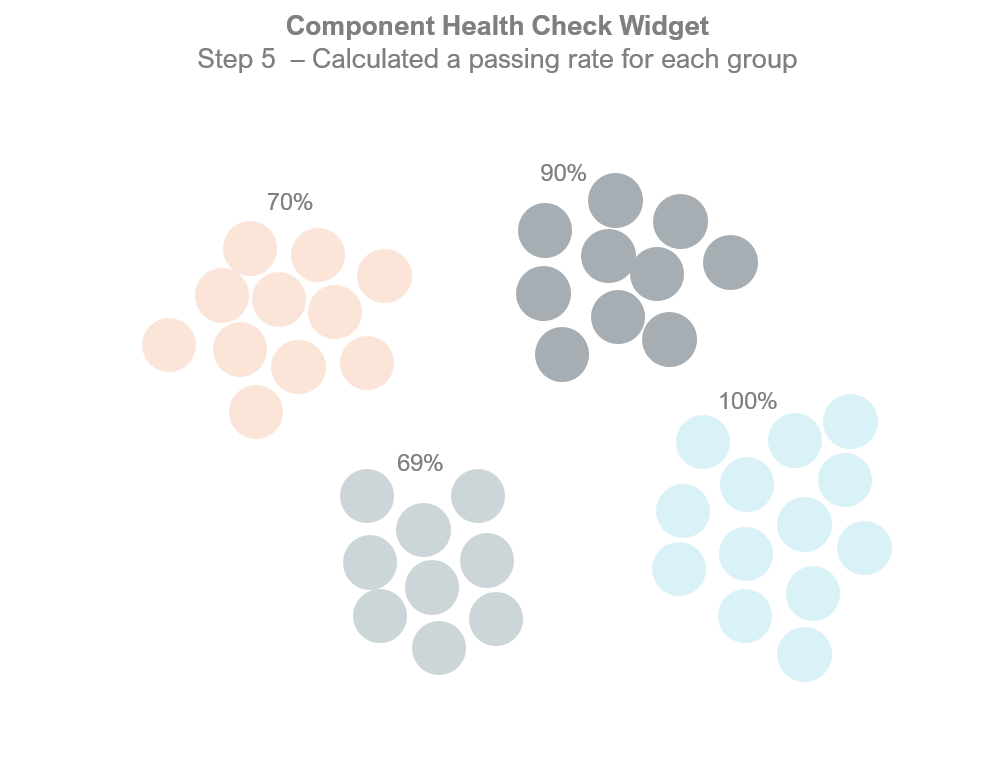
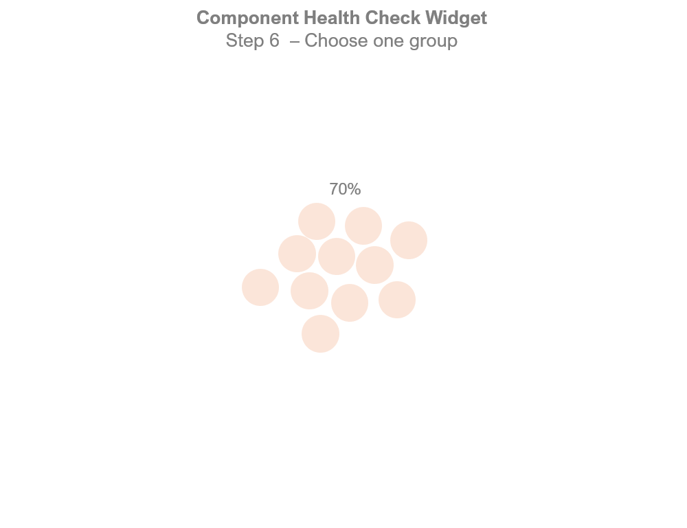
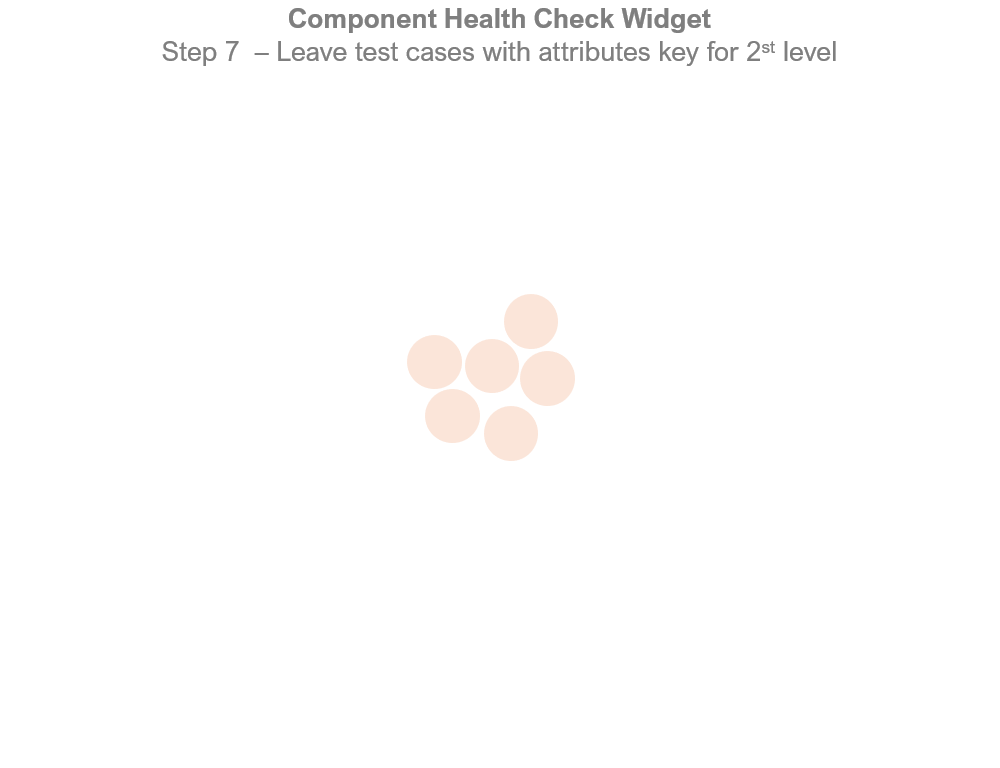
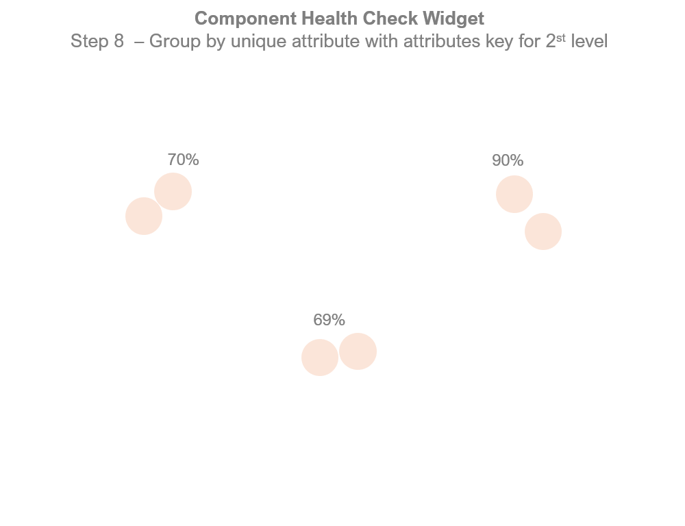

# Component health check

Shows the passing rate of the application components which are indicated by the specified attributes.

>**Note:** for using this widget you need to report (or add manually) attributes to test items.

**Widget's parameters:**
- Filter
- Parameters: All launches/ Latest launches
- The min allowable passing rate for the component: Possible value from 50 - 100%. Default value 100%.
- Attribute key for the first level (mandatory)
- Attribute key for the 2-10 levels (optional)

**Widget view**

> **Use case:**
>
> **Situation:** As a Project Manager or Test Lead, I want to see the most unstable place in my product ( application).
>
> **Solution:** All test cases in my project in ReportPortal have attributes. For example `function: (order, team, configure, administrative)`, `type: (backend, API, Unit, UI)`, ...., `market state: (open, close)`, `role: (ProjectManager, Member, Admin)` and other. The attributes can be different and dependent on your project needs.
>
>
> A user  can create a Component Health Check Widget and set attribute key = `function` for the 1st level, for the 2nd -`type` and the 3rd - `market state`
>
> So that a user will see on the first level several groups: order, team, configure, administrative.  All groups will contain only
> test cases with an attribute that contains attribute key `function`. Each group has been grouped by attribute value: order, team,
> configure, administrative.
> If a user clicks on the group `function: order`, the system will show the second level of the widget. All test items on the second
> level will contain the attribute `function: order` and attributes that contain attribute key: `type`. And these items will be
> grouped by attribute values: backend, API, Unit, UI.
> The same logic will be applied for the next levels.

**Widget level**
Each level shows all available attributes with corresponded to his level attribute key.
For each level system analyze the last 600 launches.

**Widget section**
The widget has two sections: Passed and Failed
**Failed section has:** all groups (test cases with the same attribute) which have passing rate less than passing rated which has been specified on widget wizard

**Passed section has:** all groups which have a passing rate higher than passing rated which has been specified on widget wizard

Each group on the widget has a name which equals to attribute value, passing rate = passed test cases with attribute / total test cases with attribute
number of test cases with attribute
link to the widget list view: Filter list view + test method: Test + status: Passed, Failed, Skipped, Interrupted, InProgress; the number of items is equal to the number of Test cases in the widget
a color line which depends on passing rate (see section Widget legend)
Widget legend

Widget legend has two lines: Passed and Failed
Failed

The failed line has four colors:
-    
-
-
-
And have values - less than specified on widget wizard -1
Passed

The passing line has only two colors:

slightly green  
green = Passed
And have values - from specified on widget wizard to 100%
Depends on this color scheme each group on the widget has own color.
Groups which have passing rate 100% - has color passed green
Groups which passing rate from 99 - specified on widget wizard  - has color slightly green
from 3* (Value specified on WW -  1)/4  to (Value specified on WW -1)   
from (Value specified on WW- 1)/2  to 3* (Value specified on WW- 1)/4 -
from  (Value specified on WW- 1)/4 to  2*(Value specified on WW- 1)/4  
0  - ((Value specified on WW- 1)/4 -1) -

>**Note:**
The widget doesn't contain 'IN PROGRESS" launches.
