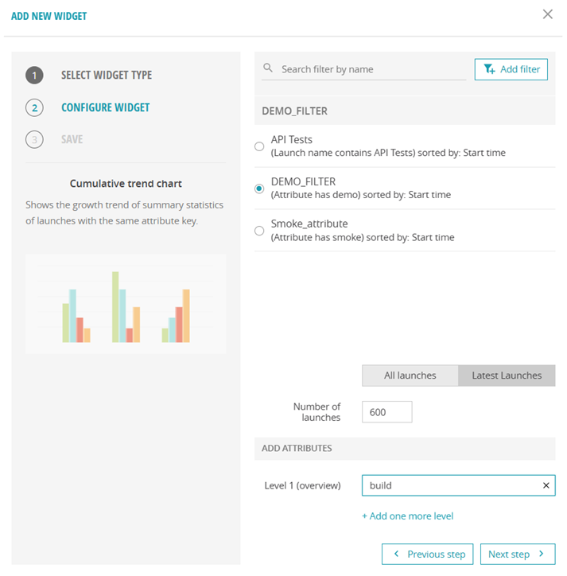
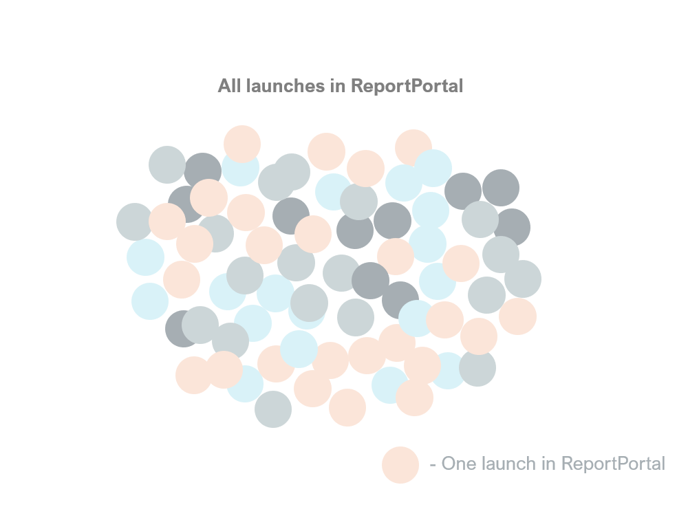
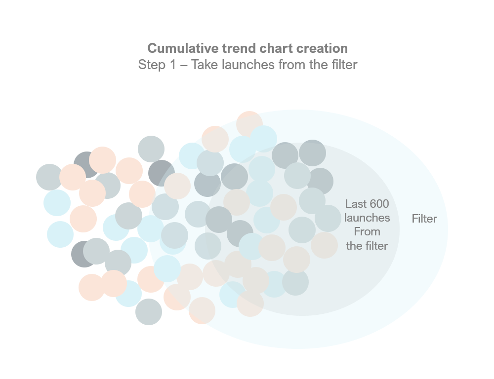
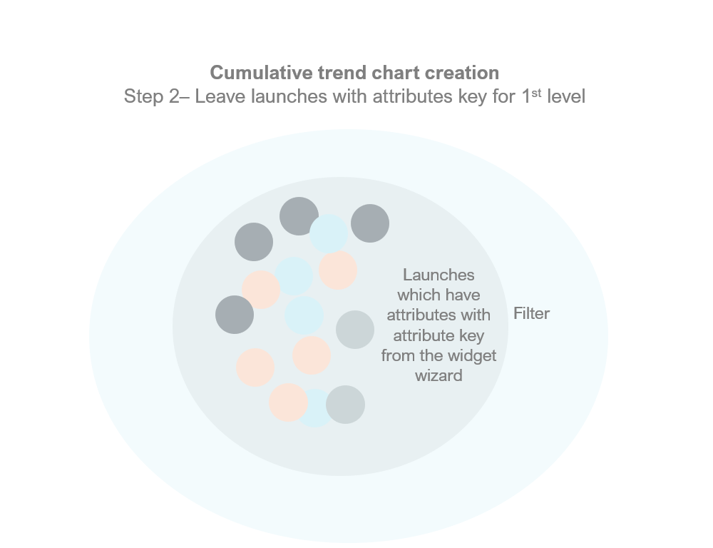
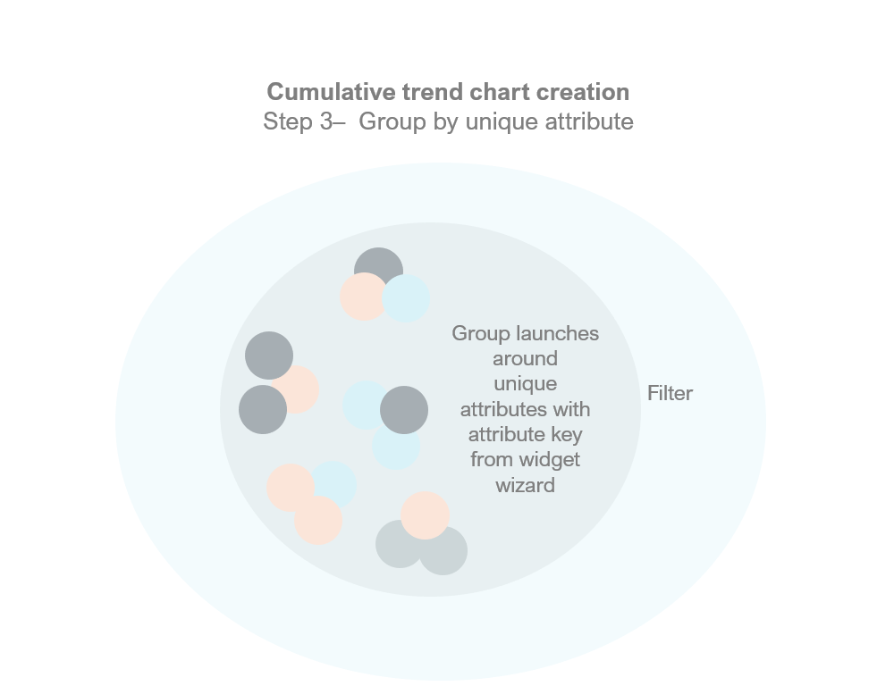
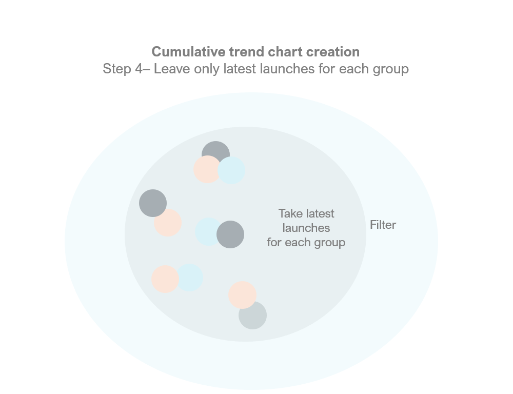

# Cumulative trend chart

Shows the growth trend of summary statistics of launches with the same attribute key.
You can see a growth of statistics from the build to the build, or from version to version.
A widget does not require an edit or new filter creation. If a new version (build, release or other) is added to ReportPortal, new information will be added to the graph.

**Widget's parameters:**
- Filter
- Parameters: only Latest launches
- Number of shown attributes on the widget: 1 - 15
- Attribute key for the first level (mandatory)
- Attribute key for the second level (optional)

**Widget view**
A widget has two levels.

**For the first level**  the system uses the last 600 launches from the chosen filter.
Then the system searches all launches which have attributes with the key specified on the widget wizard for the first widget level (for example attribute key - BUILD).
Then the system combines launches into groups around unique attribute value (BUILD:3.6, BUILD: V3.7, BUILD:3.8…..).
After that the system should keep in each group **only latest executions** (e.g. the latest launches for BUILD:3.6,  the latest launches  BUILD: V3.7,  the latest launches  BUILD:3.8…. ) and reflects statistics for all unique attributes on the graph for the first widget level.

First level view - summ statistics of launches with attributes BUILD: 3.20.8.0 / 3.20.8.1 / ... / 3.20.8.9

> **Note:**
Statistics for bars BUILD: 3.20.8.0 is calculated as - a summary of latest launches with attribute 3.20.8.0

A user can drill down to the second level of the widget. For that, he should click on the bar. And the system shows two buttons: Drill Down and Show filter.
And a user should click on **"Drill down"**.

**For the second level** the system again analyzes the 600 launches from the filter.
Then it leaves only launches that have an attribute, that has been clicked by the user (f.e. BUILD: 3.20.8.0 ).
From these launches, systems choose ones with attributes that have key attribute form the section Level 2 (detailed view) on widget wizard.
After the system groups launch with the same attribute and leaves for each selection only the “latest” launches (launches with unique launch name and with the biggest launch number in ReportPortal).
Others should be removed from a group. Each unique group should be reflected in the graph on the second widget level.

For each group there is shown a set of bars: Passed, Failed, Skipped, group Product Bug, group Auto Bug, group System Issue, group No defect, group To investigated.

On the hover on the bar, a user can see detailed information about the sample. Also, the user can see a list of attributes with attribute key from the first and from the second level which has launches, which have been used for a hovered bar.

**Visual options**

**Focus on defect types**
If the option is enabled, a user can see only information about defect types for each sample.
If an option is disabled, a user can see information about statuses and defect types.

**Totals**
If the option is enabled, a user can see info about several test cases in each sample.

**Staked area / Separate bars**
Staked area chart - is shown one bar for statuses, and one bar for defect types for each sample.
Separate bars - is shown a separate bar for each status, and each defect type group.

**Tests / Per cent**
Test mode - OY axis is calculated in test cases.
Percent mode - OY axis is calculated in percent. OY = 100%.

A user can combine different options. Options are saved per user.

>**Note:**
The widget doesn't contain 'IN PROGRESS" launches. The widget statistics calculated only in items with method type TEST.