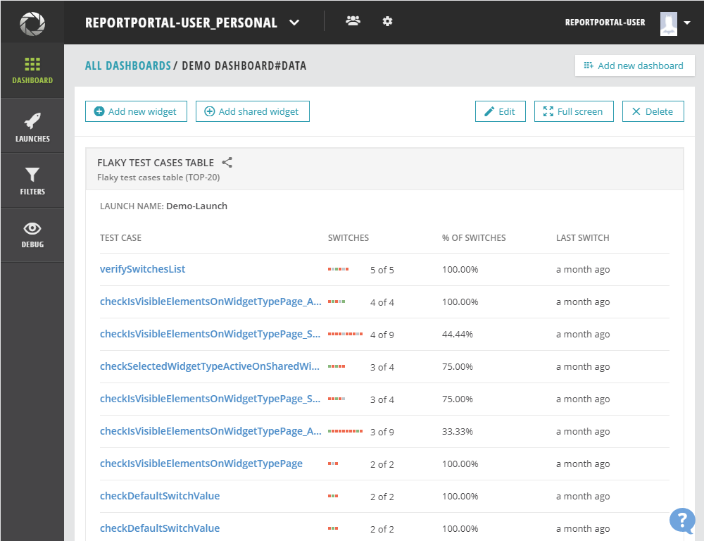

# Flaky test cases table (TOP-20)
Shows the TOP-20 the flakiest test cases within the specified previous launches. The widget defines test cases with the highest percentage of switching their status in the execution. So that you can click on the test cases and be redirected to the last test item in execution to check the reasons.

**Widget's parameters:**

- Launches count: 2-150. The default meaning is 30.

- Launch name. Is required

- Include /Exclude  Before and After methods

**Widget view**

The widget has a table view with the following data displayed:

- Test Item name - link to the Step level of the last launch

- Switches - count of found results with often switches;

- % of Switches - the percent of the fact switches and the possible;

- Last switch - date and time of the last run, when the test item switches the status, displayed in 'time ago' format (i.e. "10 minutes ago").

On mouse hover, the system will display accurate start times.

