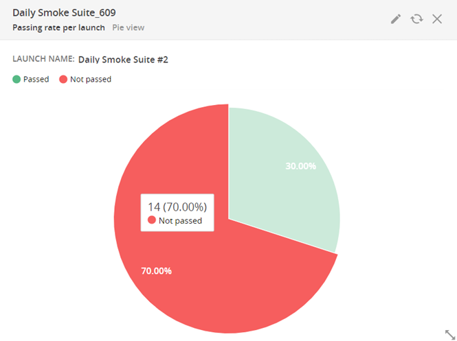

# Passing rate per launch

Shows the percentage ratio of Passed test cases to Total test cases for the last run of selected launch.

>**Note:**
>Total test cases = Passed + Not Passed, while Not Passed = Failed + Skipped + Interrupted
> 
>Thus, Passing rate = Passed / (Passed + Failed + Skipped + Interrupted)

**Widget's parameters:**

- Launch Name: the name of any finished launch

- Mode: Bar View/Pie View

- Widget name: any text

- Description: any text

Please find below an example of configuration:

As you can see, this widget was built based on the test results of the last run of the Daily Smoke Suite:

**Widget view**

The widget can be displayed in two options as shown on the pictures below:

Bar View

Pie View

The tooltip on mouse hover over chart area shows the quantity of Passed/Failed test cases and percentage ratio of Passed/Failed test cases to Total cases for the last run.

The widget has clickable sections. When you click on a specific section in the widget, the system forwards you to the launch view for appropriate selection.

>**Note:**
The widget doesn't contain 'IN PROGRESS" launches.