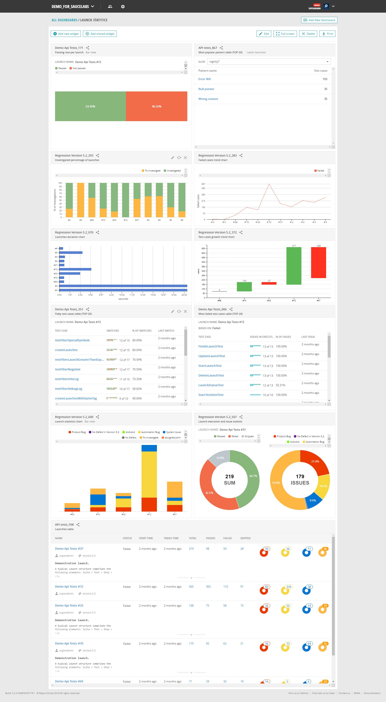
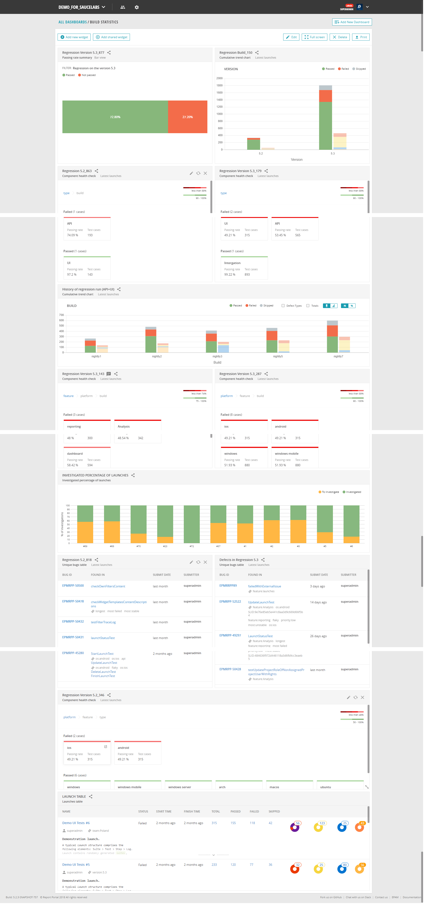

# Possible Dashboards in ReportPortal

ReportPortal.io is a powerful tool that acquires a lot of analytics. With this manual, we are wanting to help you to configure simple and understandable reports for your teams.

Let's look on 2 examples of dashboards which you can generate:
* Report for one Launch
* Report for Build (Version, Release, Sprint)

> **Precondition**
> Let's assume that we have a Regression suite which contains:
>
> - a suite with API test cases
> - a suite with UI test cases
> - a suite with integration test cases
>
> The whole Regression is running against nightly build every day.
> Different teams are responsible for different suites.
>
> Which dashboard I can create in such conditions?

##  Report for one tests run (A dashboard for an engineer)

The goal for this report to show the status of the latest test run. For instance to see the latest results for launch with an API suite. 

You can configure:
[**Passing rate widget**](https://reportportal.io/docs/Passing-rate-summary) that shows a passing rate for a latest launch "API suite'

[**Most popular pattern**](https://reportportal.io/docs/Most-popular-pattern) tracks TOP-20 problems in the last and previous runs of this suite. 

> **Note:** For Most popular pattern table, you should you create a set of rules and run Pattern Analysis

With [**Investigated percentage of launches**](https://reportportal.io/docs/Investigated-percentage-of) you can find out the status of failure investigations. You will be able to evaluate team performance and consistency of results.

[**Failed cases trend chart**](https://reportportal.io/docs/Failed-cases-trend) shows the history of failures in previous runs. 

[**Duration chart**](https://reportportal.io/docs/Launches-duration-chart) will be very helpful for those who track duration KPI and want to increase the speed of tests run. 

[**Test growth trend chart**](https://reportportal.io/docs/Test-cases-growth-trend) shows you the speed of new test cases creation.

Also, you can create [**"Most flaky test cases"**](https://reportportal.io/docs/Flaky-test-cases) and [**"Most failed test case"**](https://reportportal.io/docs/Most-failed-test-cases) and find the most unstable items which should be taken into account.

Let's assume that you have a lot of test results and a lot of teams.

You can create [**Overall statistics**](https://reportportal.io/docs/Overall-statistics) and [**Launches table**](https://reportportal.io/docs/Launches-table), and now a team who is responsible for API suite has no need to go to the test results. It can use only this dashboard which gives enough information for test failure management.

##  Build / Release/ Sprint Report (A dashboard for a Team leads, PM, DM)

The goal of this report to show status for the whole version. It means for this report we want to see the latest results of aggregated statistics for several lanches.

In our example, I want to see the latest results for the whole Regression (latest results for API suite + latest results for UI + latest results for Integration tests).

Also, it is very useful to compare the results of the Regression on the current version with the Regression on previous versions and to see details about business metrics.

On this dashboard you can see different metrics:

- A passing rate for the whole Regression
- With [**Cumulative trend chart**](https://reportportal.io/docs/Cumulative-trend-chart) you will be able to compare different versions on one chart, to compare different runs for the current regression
- [**Component Health Check Widget**](https://reportportal.io/docs/Component-health-check) would show you product:

* on different env
* on a different dimension
* by business metrics / by features/ by user roles / by etc

Also with a help of [**Component Health Check Widget**](https://reportportal.io/docs/Component-health-check) you can create a Test Pyramid.

>**Note**: you need to report test executions with attributes which specified needed metrics or envs

- [**Unique bugs table**](https://reportportal.io/docs/Unique-bugs-table) helps you collect and analyze new bugs in the system

>**Note** Component Health Check Widget and Cumulative trend chart are very configurable and you can create your own widget based on project needs.

