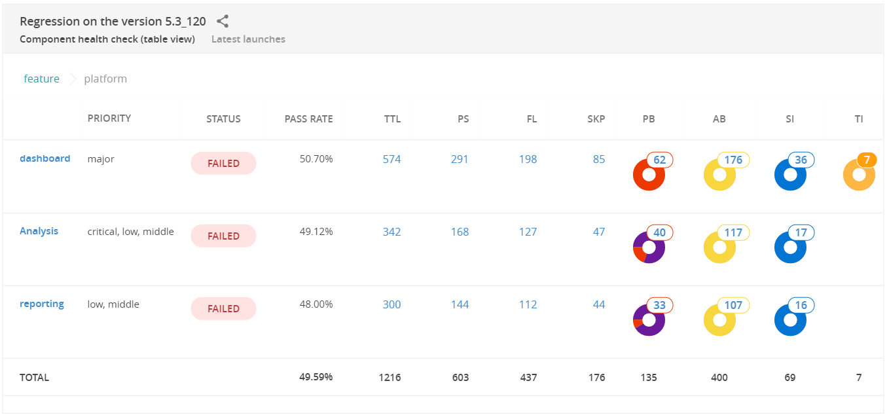

# Table Component health check

Shows the detailed statisctics of the application components which are indicated by the specified attributes.

>**Note:** for using this widget you need to report (or add manually) attributes to test items.

## Why can this widget can be useful for your project

Let's look at several use cases on how you can utilize Component Health Check Widget.

### Use case #1

**Use Case:** To track information regarding the latest version in version **without filter update**

**Problem:** You are a test lead, and you want to track information regarding the latest results without any additional movements. Your version contains several launches: a launch with API test cases, a launch with UI test cases, and a launch with Integration test cases.
You need to track summary statistics for the latest results for API launch, UI launch, and Integration launch.
For that reason, you have added an attribute 'version: XXX" to all needed launches, where specify the number of versions. And you have created a filter that includes all launches with the mentioned attribute.
Now you can create a widget Overall statistics for instance. And this widget will show you a summary of the latest results for version: xxx.
But if you run a new version (for instance version: xxx+1), you should repeat previous actions one more time: create the filter, update the widget.

**Solution:** How you can skip these steps. Create filter which includes 3 launches: API launch, UI launch, and Integration launch. Create a Component Health Check widget (table view) with this filter and add attribute key 'version' for grouping. Now you will see a summary for the latest version every day. If a new version appears in the system, a widget automatically removes info about the previous one and adds the latest version.

### Use case #2

**Use Case:** To track information regarding components such features/browsers/ platforms/ or others

**Problem:** You are running different launches API launch, UI launch, and Integration launch. In these 3 launches, there are test cases which belong to different features. One feature can have test cases with different types: API, UI, Integration. You need to track overall statistics for features, not for launch.

**Solution:** Create filter which includes 3 launches: API launch, UI launch, and Integration launch. Create a Component Health Check widget (table view) with this filter and add attribute key 'feature' for grouping. Now you will see a summary for all features from different launches.

Widget logic is the same as for [Component health check](./ComponentHealthCheck).

**Widget's parameters:**

- Filter
- Parameters: All launches/ Latest launches
- The min allowable passing rate for the component: Possible value from 50 - 100%. Default value 100%.
- Attribute key for the first level (mandatory)
- Attribute key for the 2-10 levels (optional)
- Custom column

**Widget view**

The widget has a table view. Each line contains information regarding one component (one unique attribute value):

- component name
- component passing rate
- statistics: Total/Passed/Failed/Skipped/ Product bugs/ Automation bugs/ System issues/ To investigate
- information about attribute value in the custom column

The total line shows a summary of all components.

**Custom column**

Why you may need a custom column? Let's see it in the example.

**Use case #3**

**Use Case:** You need to understand the impact of failed test cases

**Problem:** You created a Component Health Check widget and can see a list with features and their passing rate. But you can not understand the importance of failed features.

**Solution:** Add for all test executions attributes with an attribute key 'priority: XXX'. For instance:
- priority: low
- priority: major
- priority: critical

Then add to widget wizard attribute key 'priority' in the custom column field.
So that system adds to the widget view information regarding priority to each feature.

**Custom sorting*

You can choose how components should be sorted in the table.
Possible criteria:

* Total
* Passing rate
* Custom column
* Failed items

> **Note:** Component Health Check widget (table view) is the first widget that uses a materialized view of PostgreSQL. It takes time to create it. So that is why information about new launches in the filter adds dynamically. For that reason, a user should update a widget manually by сlicking on the update button. On the widget, a user can see the time for the last update.
