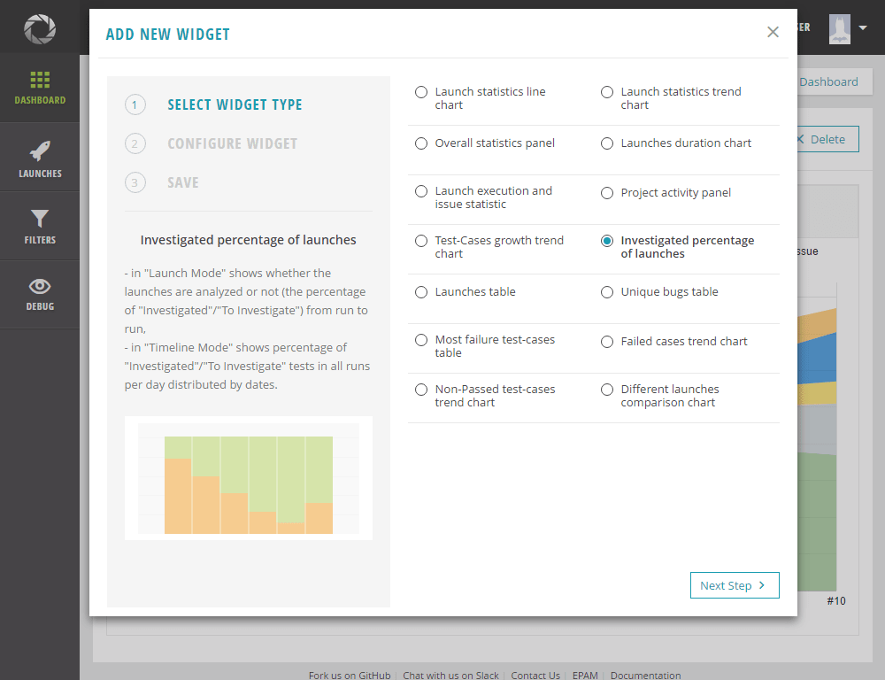

# Widget Creation

Widgets - contain special graphical control elements that were designed to provide a simple and 
easy-to-use way of displaying and analyzing your automation trends and data.

The widgets can be added to dashboards on the "Dashboards" tab. Widgets will be visible within the project, they are created.

## Create widget

To create a new widget, perform the following steps:

1. Navigate to the "All Dashboards" page and create a new dashboard or choose the existing one.

2. Click the "Add New Widget" button.

3. The Widget Wizard will be opened. To add a new widget, you need to pass all the required steps.

    • Step 1. Select the template of the widget (detailed description is below).

    • Step 2. Select a filter from the list below or create a new filter. Search functionality helps to find the filter quicker. Select other widget options: Criteria, Items, Launch or Timeline mode (if applicable for selected widget template)

    • Step 3. Enter a widget name, description and share a widget (if need). 
      A widget name should be unique for a user on the project.

4. After you have completed all steps, click the "Save" button. The new widget will be added to the dashboard on the top.

Widgets are automatically refreshed every minute.

## Predefined widgets types

There are 15 widget templates in ReportPortal for tracking different KPI:

| KPI  | Widget template |
| ------------- | ------------- |
|   | [Launch statistics chart](https://reportportal.io/docs/Launch-statistics-chart)  |
|  Passing rate for filter summary, and structure of problems |[Overall statistics](https://reportportal.io/docs/Overall-statistics)  |
|  Track the longest launch in the filter  | [Launches duration chart](https://reportportal.io/docs/Launches-duration-chart) |
|   Track the passing rate and structure of problems of the latest run in the system| [Launch execution and issue statistic](https://reportportal.io/docs/Launch-execution-and) |
|  Track the activity of your QA team | [Project activity panel](https://reportportal.io/docs/Project-activity-panel)  |
| Track the growth of new test cases in your build  | [Test-cases growth trend chart](https://reportportal.io/docs/Test-cases-growth-trend) |
| Track the speed of test failure analysis | [Investigated percentage of launches](https://reportportal.io/docs/Investigated-percentage-of)  |
| Follow up information about only important launches for your team  | [Launches table](https://reportportal.io/docs/Launches-table) |
| Track new BTS issues in your run  | [Unique bugs table](https://reportportal.io/docs/Unique-bugs-table) |
|  Track the most unstable test cases in the build | [Most failed test-cases table](https://reportportal.io/docs/Most-failed-test-cases) |
|  See the trend of the number of failed test cases from build to build | [Failed cases trend chart](https://reportportal.io/docs/Failed-cases-trend) |
|  See the trend of the number of failed and skipped test cases from build to build | [Non-passed test-cases trend chart](https://reportportal.io/docs/Non-passed-test-cases-trend)  |
| Compare two launches together  | [Different launches comparison chart](https://reportportal.io/docs/Different-launches-comparison) |
|  Track passing rate for one launch | [Passing rate per launch](https://reportportal.io/docs/Passing-rate-per)  |
| Track passing rate for the build  | [Passing rate summary](https://reportportal.io/docs/Passing-rate-summary) |
|  Find the most flakiest test in the build | [Flaky test cases table (TOP-20)](https://reportportal.io/docs/Flaky-test-cases)  |
| Compare statistics for different builds on one graph  | [Cumulative trend chart](https://reportportal.io/docs/Cumulative-trend-chart) |
| Track the most popular failure reasons in the build  | [Most popular pattern table (TOP-20)](https://reportportal.io/docs/Most-popular-pattern)  |
| Track the passing rate of different components of your application | [Component health check](https://reportportal.io/docs/Component-health-check) |
| Track the statistics of different components of your application  | [Component health check (table)](https://reportportal.io/docs/Table-Component-health) |
| Track the top-20 tests with longest execution time| [Most time-consuming test cases widget (TOP-20)](https://reportportal.io/docs/Most-time-consuming-test)|
