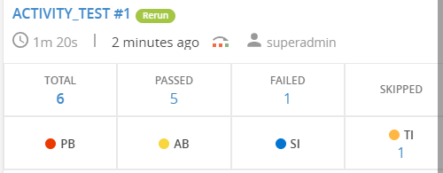

# Rerun developers guide

1. [What is rerun](#what-is-rerun)
1. [How to start rerun](#how-to-start-rerun)
    1. [Latest launch](#latest-launch)
    1. [Specified launch](#specified-launch)
1. [Test items behavior](#test-items-behavior)
1. [Example](#example)

## What is rerun

Let's imagine we have some set of tests:


After run we can see few failed items:


We are fixing issues and want to launch tests again. But running all the tests can take a lot of time. So it would be better to run only failed tests from previous launch.

Now we have the following:


So what do we have here? Two launches with the same tests that was just be started again, but they are have difference in passed and failed items. And it is hard to find which test was fixed and which was not.

The main idea of reruns is to restart the same launch and trace changes between them not creating new launch every time.

Let's try to report the same launches using rerun.



We have only one launch with last run data


On the step view we can see that items with names `getActivitiesForProject`, `getActivityPositive` and `getTestITemActivitiesPositive` have retries. Items `getActivityPositive` and `getTestITemActivitiesPositive` was fixed and `getActivitiesForProject` is still failing.

## How to start rerun

### Latest launch

#### Using API

To start launch rerun you should call [default start launch endpoint](reporting.md#start-launch) adding `"rerun"=true` parameter in the request body.

```json 
{
  "name": "launch_name",
  "description": "some description",
  "mode": "DEFAULT",
  "rerun": true
}
```
And response will contain found launch `id` for asynchronous endpoint or `id` and `number` for synchronous.  
 
```json
{
  "id": "89f6d409-bee0-428e-baca-4848f86c06e7",
  "number": 4
}
```

#### Using agent

To start launch rerun add `rp.rerun=true` to `reportportal.properties` file. No need to change anything else(name, project, etc.).

```properties
rp.endpoint=https://rp.com
rp.apiKey=caccb4bd-f6e7-48f2-af3a-eca0f566b3bd
rp.launch=rerun_test_example
rp.project=reporting-test
rp.reporting.async=true
rp.rerun=true
```

#### Handling

System tries to find the latest launch on the project with same name as in request.

If launch found - system updates the following attributes (if they are present in request and they are different from stored):
- Mode
- Description
- Attributes
- UUID
- Status = `IN_PROGRESS`

If system cannot find launch with the same name - system throws error with `404` code.

### Specified launch

#### Using API

To start launch rerun you should call [default start launch endpoint](reporting.md#start-launch) adding `"rerun"=true` and `"rerunOf"=launch_uuid` parameters in the request body. Where `launch_uuid` is UUID of launch that have to be reruned.

```json
{
  "name": "launch_name",
  "description": "some description",
  "mode": "DEFAULT",
  "rerun": true,
  "rerunOf": "79446272-a439-45f9-8073-5ca7869f140b"
}
```

And response will contain found launch `id` for asynchronous endpoint or `id` and `number` for synchronous.  
 
```json
{
  "id": "79446272-a439-45f9-8073-5ca7869f140b",
  "number": 4
}
```

#### Using agent

To start launch rerun set `rp.rerun=true` and `rp.rerun.of=launch_uuid` in `reportportal.properties` file. Where `launch_uuid` is UUID of launch that have to be reruned.

```properties
rp.endpoint=https://rp.com
rp.apiKey=caccb4bd-f6e7-48f2-af3a-eca0f566b3bd
rp.launch=rerun_test_example
rp.project=reporting-test
rp.reporting.async=true
rp.rerun=true
rp.rerun.of=79446272-a439-45f9-8073-5ca7869f140b
```
Where `79446272-a439-45f9-8073-5ca7869f140b` is UUID of desired launch.

#### Handling

The same as for [specified launch](#specified-launch).

## Test Items behavior

There are no differences in API calls for starting and finishing items inside rerun launch. But such items handling is different.

### Container types (has children)

System tries to find item with the same name, set of parameters and under the same path.
 
If such item found - the following attributes will be updated:

- Description
- UUID
- Status = `IN_PROGRESS`
 
If not - new item will be created.

### Step types (without children)

System tries to find item with the same name, set of parameters and under the same path.
 
If such item found - retry of the item will be created.
 
If not - new item will be created.

## Example

You can try to rerun launch [here](https://github.com/reportportal/examples-java)


