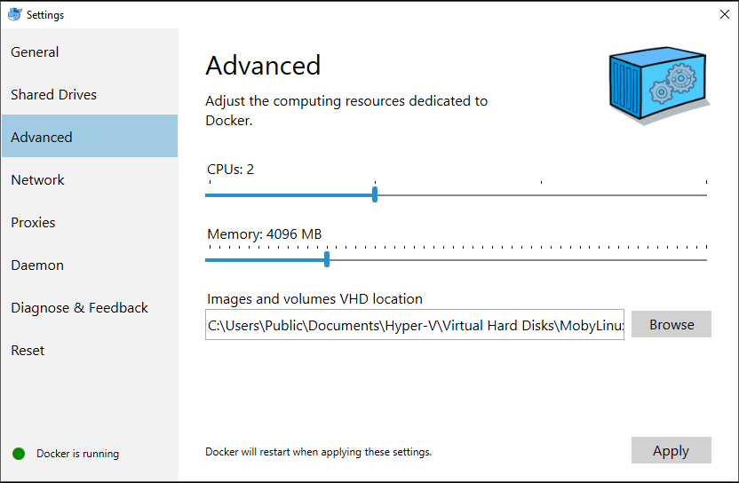
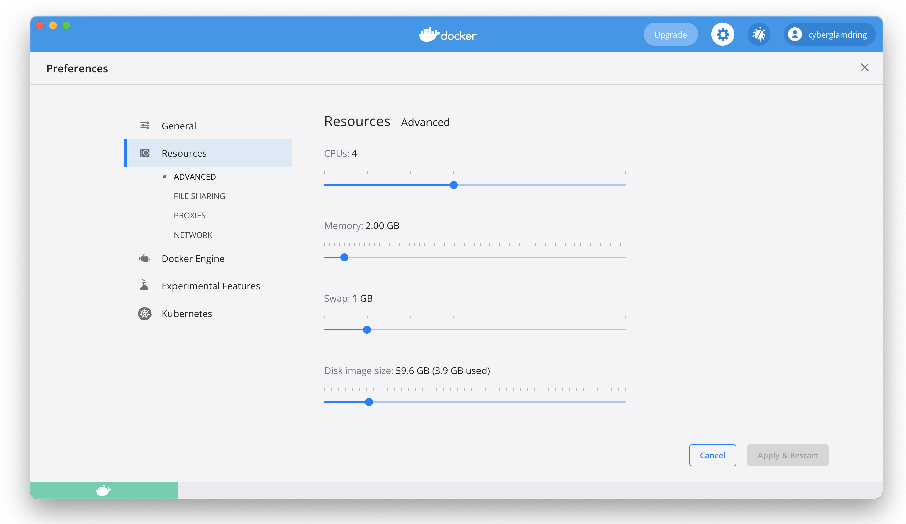

# Deploy with Docker ReportPortal

ReportPortal can be easily deployed using Docker-Compose. 

## Install Docker

Docker is supported by all major Linux distributions, MacOS and Windows

[Download](https://www.docker.com/get-started) and install Docker, Docker Compose


> **Note:**
> 
> If you use Docker for Windows or MacOS, make sure there is at least 3gb dedicated for Docker.
> For Windows native docker:
> 
> 
> For MacOS native docker:
> 


***Note: for Windows users.***
*[Docker for Windows](https://docs.docker.com/docker-for-windows/) requires 64-bit Windows 10 Pro and Microsoft Hyper-V. 


## Deploy ReportPortal with Docker

1) Make sure the Docker [Engine](https://docs.docker.com/engine/install/) and [Compose](https://docs.docker.com/compose/install/) are installed.

2) Download the latest ReportPortal Docker compose file from [here](<https://github.com/reportportal/reportportal/blob/master/docker-compose.yml>). You can make it by run the following command: 

  ```Bash
curl -LO https://raw.githubusercontent.com/reportportal/reportportal/master/docker-compose.yml
  ```

3) Make the ElasticSearch configuration prerequisites for the analyzer service

a) Set {vm.max_map_count} kernel setting before ReportPortal deploying with the following [Commands](https://www.elastic.co/guide/en/elasticsearch/reference/7.10/docker.html#docker-cli-run-prod-mode)

b) Give right permissions to ElasticSearch data folder using the following commands:

```Bash
mkdir -p data/elasticsearch
``` 

```Bash
chmod 777 data/elasticsearch
``` 

```Bash
chgrp 1000 data/elasticsearch
``` 

For more details about ElasticSearch visit ElasticSearch [guide](https://www.elastic.co/guide/en/elasticsearch/reference/7.10/docker.html#_notes_for_production_use_and_defaults)

4) > OPTIONAL

PostgreSQL Performance Tuning

Depends on your hardware configuration and parameters of your system, you can additionally optimize your PostgreSQL performance by adding the following parameters to "command" option in the Docker compose file:

```Bash
 -c effective_io_concurrency=
 -c shared_buffers=
 -c max_connections=
 -c effective_cache_size=
 -c maintenance_work_mem=
 -c random_page_cost=
 -c seq_page_cost= 
 -c min_wal_size= 
 -c max_wal_size=
 -c max_worker_processes=
 -c max_parallel_workers_per_gather=
``` 

Please choose set the values of these variables that are right for your system.

You can also change PostgreSQL host by passing a new value to POSTGRES_SERVER environment [variable](https://reportportal.io/docs/Additional-configuration-parameters). 

5) Start the application using the following command:

```Shell
docker-compose -p reportportal up -d --force-recreate
``` 
Where:
- **-p reportportal** adds project prefix 'reportportal' to all containers
- **up** creates and starts containers
- **-d** daemon mode
- **--force-recreate** Re-creates containers if there any

**Useful commands:**
- **docker-compose logs** shows logs from all containers
- **docker logs &lt;container_name&gt;** shows logs from selected container
- **docker ps -a | grep "reportportal_" | awk '{print $1}' | xargs docker rm -f** Deletes all ReportPortal containers

6) Open your web-browser with an IP address of the deployed environment at port **8080**

You can get the host IP address by using the following docker commands:  

> If you run Docker on macOS or Windows with Docker for Mac, Docker for Windows  

```Bash
docker inspect -f '\{{range .NetworkSettings.Networks}}\{{.IPAddress}}\{{end}}' CONTAINER_ID_OR_NAME
```

> If you run Docker on Linux, you can find your public IP address in Linux Terminal

```Bash
curl ifconfig.co
```

ReportPortal address:  
```
http://IP_ADDRESS:8080
```

Use the following **login\pass** to access: 
* Default User: `default\1q2w3e`
* Administrator: `superadmin\erebus`

> Please change the admin password for better security


## Deploy ReportPortal with Docker on Windows

In case you went with Docker on Windows, please make sure you changed the 'volumes' value for postgres container from "For unix host" to the "For windows host":  

```Shell
  volumes:
    # For windows host
    - postgres:/var/lib/postgresql/data
    # For unix host
    # - ./data/postgres:/var/lib/postgresql/data
``` 

> If you haven’t done this, you will get an error
> 
> ```Shell
> data directory “/var/lib/postgresql/data/pgdata” has wrong ownership
> ``` 

Then uncomment the following:

```Shell
    volumes:
     # For unix host
     # - ./data/storage:/data 
     # For windows host
      - minio:/data
 ```
 
And after that uncomment the following:  

```Shell
# Docker volume for Windows host
volumes:
  postgres:
  minio:
``` 


### Updating ReportPortal with Docker

Updating ReportPortal with Docker is a two step process.  

In the first step, your Docker Compose file should be replaced with a new one (with the latest version services) from [here](<https://github.com/reportportal/reportportal/blob/master/docker-compose.yml>).

The second step is update / redeploy the application using the following command:  

```Shell
docker-compose -p reportportal up -d --force-recreate
``` 

There is no strict need for backup / restore the data if you are keep the postgres, elasticsearch & minio volumes. However, it is recommended (see Maintain commands Cheat sheet).  


## ReportPortal Services

The ReportPortal consists of the following services:

- Authorization Service. In charge of access tokens distribution.
- Gateway Service. Main entry point to application. Port used by gateway should be opened and accessible from outside network.
- API Service. Main application API.
- UI Service. All statics for user interface.
- Analyzer Service. Collects and processes the information, then sends it to ElasticSearch
- Index Service. Responsible for redirections, collection of services information, handling errors

