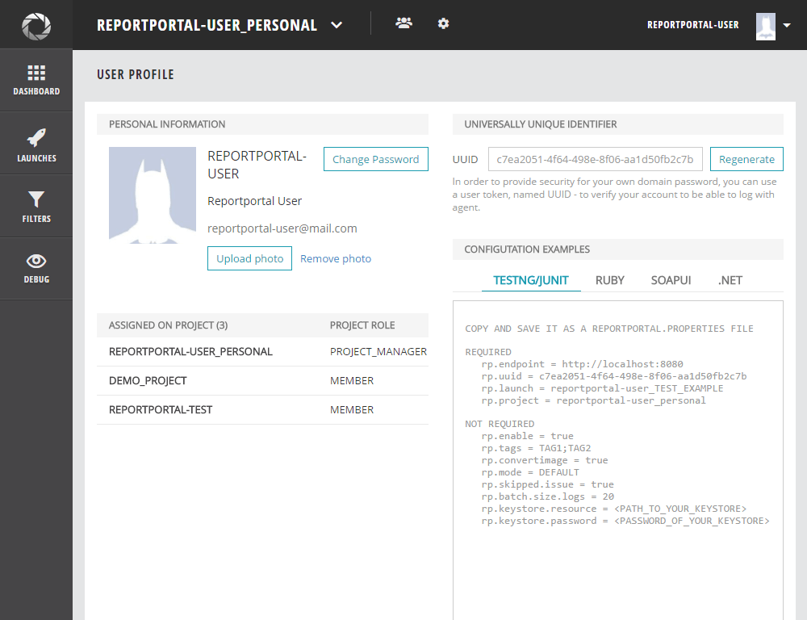

### ScalaTest

#### Installation
1) add this library to your project as dependency
   * SBT
    >
    >      libraryDependencies += "com.epam.reportportal" %% "agent-scala-scalatest" % "5.0.4" % "test"
    >

   * Maven
    >      <dependency>
    >        <groupId>com.epam.reportportal</groupId>
    >        <artifactId>agent-scala-scalatest_2.13</artifactId>
    >        <version>5.0.4</version>
    >        <scope>test</scope>
    >      </dependency>

   * Gradle
    >
    >      testCompile group: 'com.epam.reportportal', name: 'agent-scala-scalatest_2.13', version: '5.0.4'
    >

2) Add your reportportal.properties file to test/resources (See Configuration section)

3) Set reporter in your build tool:
   * _maven_ (Configuration options / Reporters): 
  
    http://www.scalatest.org/user_guide/using_the_scalatest_maven_plugin
   * _sbt_
  
    In your build.sbt
   ```scala
   testOptions in Test += Tests.Argument(TestFrameworks.ScalaTest, "-C", "com.epam.reportportal.scalatest.RPReporter")
   ```
   * _gradle:_ in your test task: 
   ```groovy
   args = ['-C', 'com.epam.reportportal.scalatest.RPReporter']
   ```
4) define repository
   * _maven, sbt_: included by default
   * _gradle_
     ```groovy
     repositories {
         mavenCentral()
     }
     ```

#### Starting Logging

To start logging with ReportPortal, add a specific listener to your automation
framework, called an agent.

An agent consists of 2 parts:

-   Structure listener

-   Log listener (appender)

Use the configuration suggestion at the **Profile** page; it will help you with
the required parameters.



To configure logging, follow these steps:

1. Configure a structure listener according to the information in one of the topics above.

2. Configure a log appender, according to the description at the Logging Integration page.

3. Configure the properties file as described in the topic above.

4. Don't forget about the JKS (Java Key Storage) file for a Java-based project.

5. Execute your automation tests.

6. Select your project as described above.
