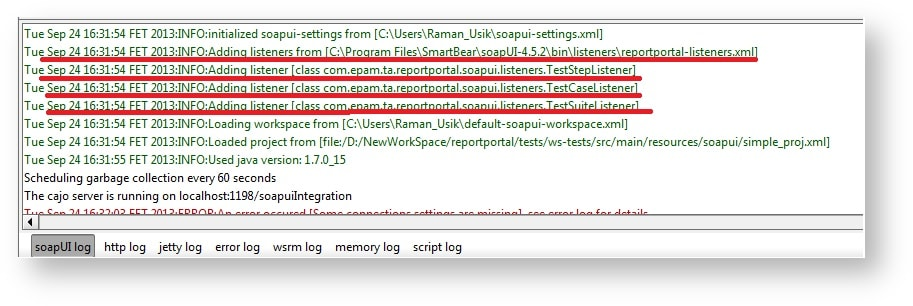
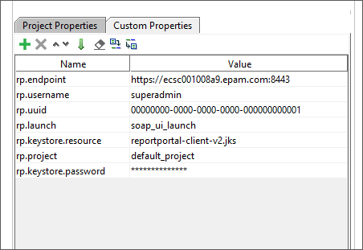

### SoapUI

#### Installation

You can download the SoapUI agent from
[here](<https://github.com/reportportal/agent-java-soapui>).

**Option 1: Desktop SoapUI**

The SoapUI agent is provided as zip archive. To unpack this archive into the SoapUI root folder, and **override** conflicted files.
To remove the below jars from */lib* directory because old versions:

-   log4j
-   guava
    ... and any other found in /lib folder

To verify that agent is successfully installed start SoapUI and see the logs:



Now that the agent is plugged into the SoapUI.

**HTTPS**

For access to the servers working via HTTPS protocol - The JKS keystore, provided by RP, is required.
The Keystore to access the RP is available [here](#user-profile). Please place it under the ${SOAPUI-HOME}/bin

**Option 2: Via the Maven Plugin in the external automation**

Add the dependency XML (please check latest available version under specified artifactory and use it instead provided):

```xml
<dependency>
   <groupId>com.epam.ta.reportportal</groupId>
   <artifactId>soapui-client</artifactId>
   <version>2.1.9</version>
</dependency>
```

To exclude conflicted dependencies from soapui-maven-plugin.

```xml
<groupId>eviware</groupId>
<artifactId>maven-soapui-plugin</artifactId>
<version>4.5.1</version>
<exclusions>
   <exclusion>
      <artifactId>httpclient</artifactId>
      <groupId>org.apache.httpcomponents</groupId>
   </exclusion>
   <exclusion>
      <artifactId>httpcore</artifactId>
      <groupId>org.apache.httpcomponents</groupId>
   </exclusion>
   <exclusion>
      <artifactId>commons-codec</artifactId>
      <groupId>commons-codec</groupId>
   </exclusion>
   <exclusion>
      <artifactId>httpmime</artifactId>
      <groupId>org.apache.httpcomponents</groupId>
   </exclusion>
   <exclusion>
      <artifactId>log4j</artifactId>
      <groupId>log4j</groupId>
   </exclusion>
</exclusions>
```

Add the property XML to the plugin section.

```xml
<property>
   <name>soapui.ext.listeners</name>
   <value>PATH TO FOLDER CONTAINS reportportal-listeners.xml FILE</value>
</property>
```

Now put your soapui-log4j.xml in project directory (or made it available under classpath).


#### Configuration

ReportPortal listeners described under ${SOAPUI-HOME}/bin/listeners/reportportal-listeners.xml for Desktop SoapUI version, or in user-specified file for maven plugin using:

**reportportal-listeners.xml**
~~~~~~~~~~~~~~~~~~~~~~~~~~~~~~~~~~~~~~~~~~~~~~~~~~~~~~~~~~~~~~~~~~~~~~~~~~~~~~~~~~~~~~~~~~~~~~~~~~~~~~~~~~~~~~~~~~~~ xml
 <?xml version="1.0" encoding="UTF-8"?> <tns:soapui-listeners xmlns:tns="http://eviware.com/soapui/config">
<tns:listener id="TestStepListener" listenerClass="com.epam.ta.reportportal.soapui.listeners.TestStepListener"
   listenerInterface="com.eviware.soapui.model.testsuite.TestRunListener" />
<tns:listener id="TestCaseListener" listenerClass="com.epam.ta.reportportal.soapui.listeners.TestCaseListener"
   listenerInterface="com.eviware.soapui.model.testsuite.TestSuiteRunListener" />
<tns:listener id="TestSuiteListener" listenerClass="com.epam.ta.reportportal.soapui.listeners.TestSuiteListener"
   listenerInterface="com.eviware.soapui.model.testsuite.ProjectRunListener" />
</tns:soapui-listeners>
~~~~~~~~~~~~~~~~~~~~~~~~~~~~~~~~~~~~~~~~~~~~~~~~~~~~~~~~~~~~~~~~~~~~~~~~~~~~~~~~~~~~~~~~~~~~~~~~~~~~~~~~~~~~~~~~~~~~

### Desktop SoapUI

In order to configure the SoapUI agent the user has to set the follows properties into the project custom properties or set them via system variables. For example:



Add in the following text format:

~~~~~~~~~~~~~~~~~~~~~~~~~~~~~~~~~~~~~~~~~~~~~~~~~~~~~~~~~~~~~~~~~~~~~~~~~~~~~~~~ java
rp.username = andrei_ramanchuk
rp.uuid = 00000000-0000-0000-0000-000000000001
rp.endpoint = https://rp.epam.com

rp.launch = soapui_TEST_EXAMPLE
rp.project = default_project
rp.tags = TAG1;TAG2
rp.batch.size.logs = 1
rp.mode = DEFAULT

## Optionally you can provide JKS keystore with certificate
rp.keystore.resource = your_keystore.jks
rp.keystore.password = keystore_password
~~~~~~~~~~~~~~~~~~~~~~~~~~~~~~~~~~~~~~~~~~~~~~~~~~~~~~~~~~~~~~~~~~~~~~~~~~~~~~~~

#### Logging

If you need to make changes to logging you may override soapui-log4j.xml. Use "REPORTPORTAL" appender if you want to track messages to ReportPortal.

```xml
<?xml version="1.0" encoding="UTF-8"?>
<!DOCTYPE log4j:configuration SYSTEM "log4j.dtd">

<!-- ===================================================================== -->
<!-- -->
<!-- This is an example of a Log4j XML configuration file. -->
<!-- -->
<!-- ===================================================================== -->

<log4j:configuration xmlns:log4j="http://jakarta.apache.org/log4j/"
    debug="false">

    <!-- =================== -->
    <!-- Appenders -->
    <!-- =================== -->

    <appender name="CONSOLE" class="org.apache.log4j.ConsoleAppender">
        <errorHandler class="org.apache.log4j.helpers.OnlyOnceErrorHandler" />
        <param name="Target" value="System.out" />
        <param name="Threshold" value="DEBUG" />
        <layout class="org.apache.log4j.PatternLayout">
            <!-- The default pattern: Date Priority [Category] Message\n -->
            <param name="ConversionPattern" value="%d{ABSOLUTE} %-5p [%c{1}] %m%n" />
        </layout>
    </appender>

    <appender name="FILE" class="org.apache.log4j.RollingFileAppender">
        <errorHandler class="org.apache.log4j.helpers.OnlyOnceErrorHandler" />
        <param name="File" value="soapui.log" />
        <param name="Threshold" value="INFO" />
        <param name="Append" value="false" />
        <param name="MaxFileSize" value="5000KB" />
        <param name="MaxBackupIndex" value="50" />
        <layout class="org.apache.log4j.PatternLayout">
            <param name="ConversionPattern" value="%d %-5p [%c{1}] %m%n" />
        </layout>
    </appender>

    <appender name="ERRORFILE" class="org.apache.log4j.RollingFileAppender">
        <errorHandler class="org.apache.log4j.helpers.OnlyOnceErrorHandler" />
        <param name="File" value="soapui-errors.log" />
        <param name="Threshold" value="INFO" />
        <param name="Append" value="true" />
        <param name="MaxFileSize" value="5000KB" />
        <param name="MaxBackupIndex" value="50" />
        <layout class="org.apache.log4j.PatternLayout">
            <param name="ConversionPattern" value="%d %-5p [%c{1}] %m%n" />
        </layout>
    </appender>

    <appender name="SOAPUI" class="com.eviware.soapui.support.log.SoapUIAppender">
        <errorHandler class="org.apache.log4j.helpers.OnlyOnceErrorHandler" />
    </appender>
    <appender name="REPORTPORTAL"
        class="com.epam.ta.reportportal.soapui.log.SoapUILogAppender">
        <errorHandler class="org.apache.log4j.helpers.OnlyOnceErrorHandler" />
        <layout class="org.apache.log4j.PatternLayout">
            <param name="ConversionPattern" value="%d %-5p [%c{1}] %m%n" />
        </layout>
    </appender>
    <appender name="GLOBAL_GROOVY_LOG" class="org.apache.log4j.FileAppender">
        <errorHandler class="org.apache.log4j.helpers.OnlyOnceErrorHandler" />
        <param name="File" value="global-groovy.log" />
        <param name="Threshold" value="DEBUG" />
        <param name="Append" value="true" />
        <layout class="org.apache.log4j.PatternLayout">
            <param name="ConversionPattern" value="%d %-5p [%c{1}] %m%n" />
        </layout>
    </appender>


    <!-- =============== -->
    <!-- Loggers -->
    <!-- =============== -->
    <logger name="groovy.log">
        <level value="INFO" />
        <appender-ref ref="GLOBAL_GROOVY_LOG" />
        <appender-ref ref="REPORTPORTAL" />
    </logger>

    <logger name="com.eviware.soapui">
        <level value="DEBUG" />
        <appender-ref ref="SOAPUI" />
        <appender-ref ref="CONSOLE" />
        <appender-ref ref="REPORTPORTAL" />
    </logger>

    <logger name="soapui.errorlog">
        <level value="DEBUG" />
        <appender-ref ref="ERRORFILE" />
        <appender-ref ref="REPORTPORTAL" />
    </logger>

    <logger
        name="com.eviware.soapui.impl.wsdl.support.http.SoapUIMultiThreadedHttpConnectionManager">
        <level value="ERROR" />
        <appender-ref ref="ERRORFILE" />
        <appender-ref ref="REPORTPORTAL" />
    </logger>

    <logger name="com.eviware.soapui.impl.wsdl.WsdlSubmit">
        <level value="ERROR" />
        <appender-ref ref="ERRORFILE" />
        <appender-ref ref="REPORTPORTAL" />
    </logger>

    <root>
        <priority value="INFO" />
        <appender-ref ref="FILE" />
        <appender-ref ref="REPORTPORTAL" />
    </root>

</log4j:configuration>
```
