# Azure DevOps BTS

Integration with ReportPortal can be helpful for projects which are already using Azure DevOps BTS (Bug Tracking System) as a tracking tool. This feature allows posting issues and linking/unlinking issues, getting updates on their statuses. For example, just a few clicks – and bug with detailed logs is created!

Azure DevOps BTS integration can be configured on the global level (for all projects on the instance) or on the project level (only for one project).

## Global Azure DevOps BTS integration

### Add new global Azure DevOps BTS integration

You might want to configure **global integrations** which will be applied on all projects if all projects on your instance are using the same Azure DevOps BTS projects.

1. Log in as ADMIN.

2. Go to Administrate > Plugins.

3. Click on Azure DevOps plugin.

4. Click on the “Add integration” button.

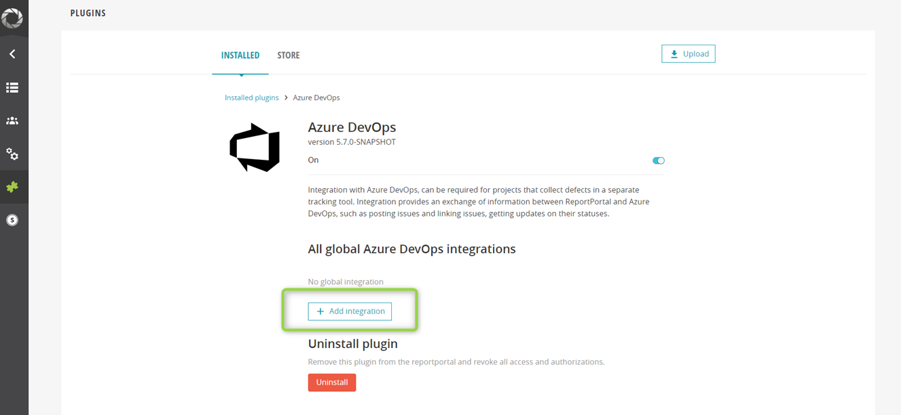

5. Fill and Save the authorization form.

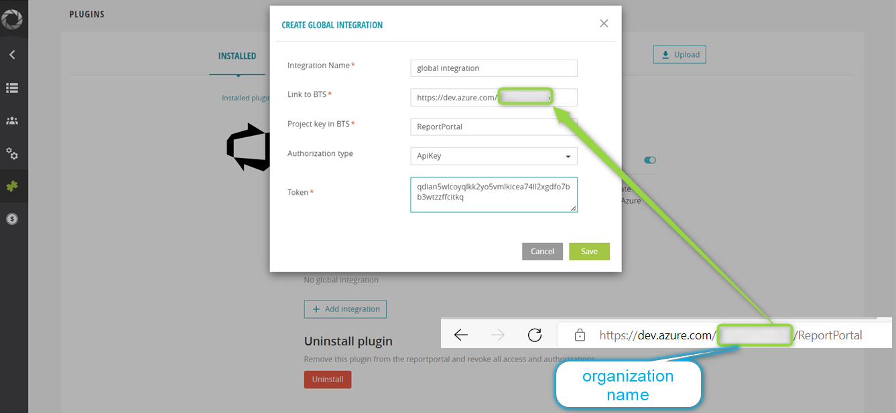

Please, follow the steps below to get a token for Azure DevOps integration:

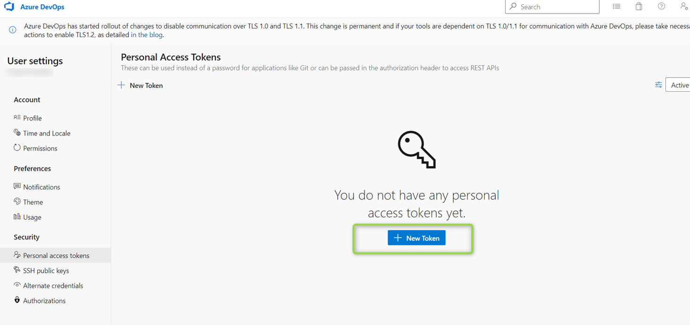

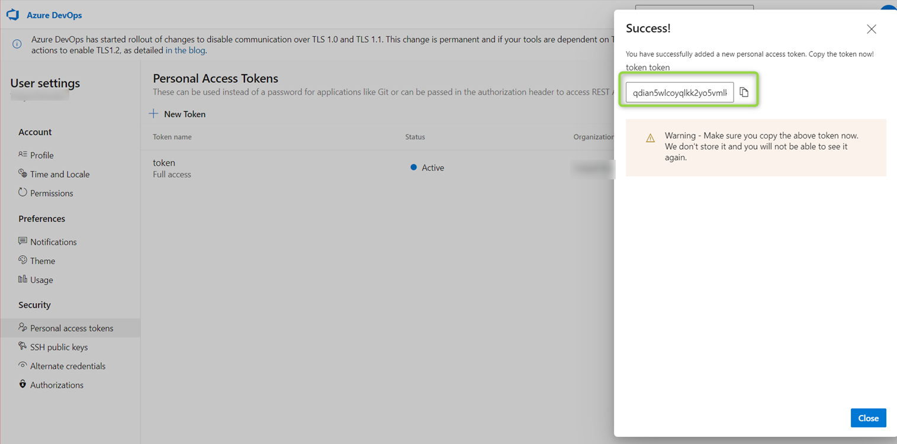

You can choose predefined Azure DevOps ticket fields after you have created a connection with the Azure DevOps BTS project. These fields will be shown to you all the time when you post an issue to the Azure DevOps BTS.

This feature also gives you the ability to choose proper issue type for newly created issues in Azure DevOps BTS.

To choose a needed issue type and predefined field for the chosen issue, you should perform the following actions on the opened **Configuration** form:

1. Choose issue type from the drop-down.

2. 2.Check the fields needed and fill them in if necessary.

3. Click on “Submit” button.

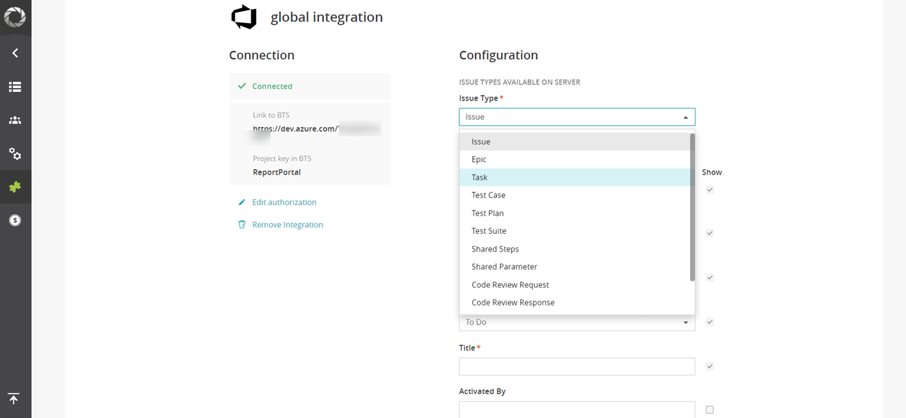

Now team members on all your projects will be able to submit issues in Azure DevOps BTS. Options for Post Issue/Link issue are activated.

You can add more integrations by clicking on “Add integration”.

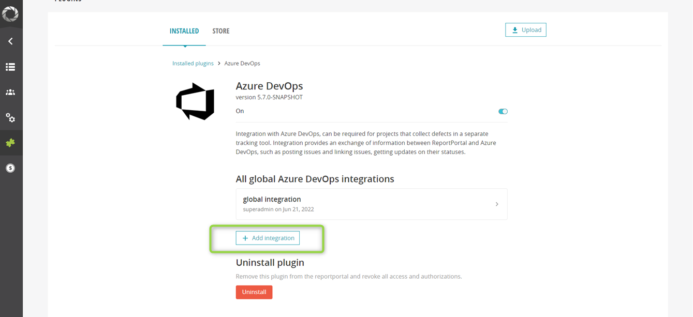

User can add several integrations, but with a different name to the **one Azure DevOps BTS project**.

**Use case:**

**Situation:** User wants to post to Azure DevOps BTS issues with type **Issue** and **Task** to the project NNN-MMM in Azure DevOps BTS. Is it possible? Yes!

**Solution:** Add two integrations to the project NNN-MMM in Azure DevOps BTS with names e.g., “Project -1” and “Project -2”. Add to the “Project -1” issue type **Issue** and for “Project -2” - issue type **Task**. While posing issue procedure, choose integration with needed type.

### Update global Azure DevOps BTS integration

If you need to edit Azure DevOps BTS integration authorization parameters, please perform actions:

1. Log in as ADMIN.

2. Go to Administrate > Plugins.

3. Click on Azure DevOps plugin.

4. Click on a tab with existing integration.

5. Click on “Edit authorization” link.

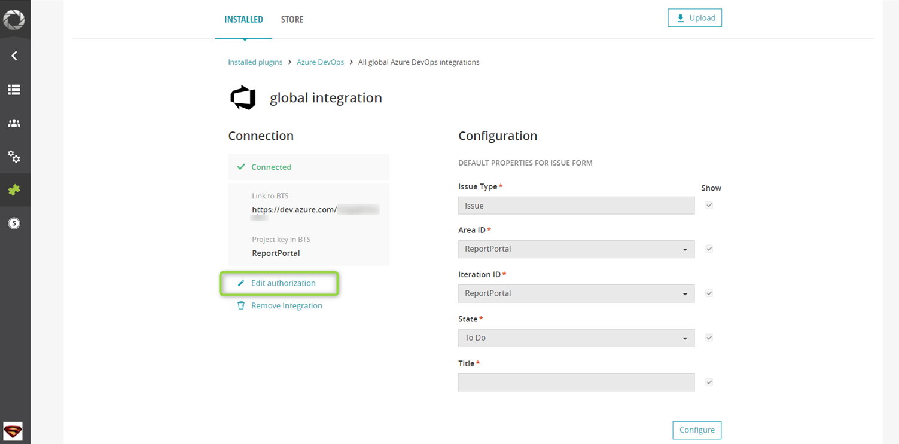

6. Change “Integration name”.

7. Type your Azure DevOps credentials.

8. Submit the form.

>**Note:**
You can edit only “Integration name”. If you need other changes, please submit new integration.

If you need to edit fields which should be posted in Azure DevOps BTS, please perform actions:

1. Log in as ADMIN.

2. Go to Administrate > Plugins.

3. Click on Azure DevOps plugin.

4. Click on the tab with existing integration.

5. Click on “Configure” button.

6. Choose issue type from the drop-down.

7. Check the fields needed and fill them in if necessary.

8. Click on “Submit” button.

### Remove global Azure DevOps BTS integration

If you need to remove Azure DevOps BTS integration, please perform actions:

1. Log in as ADMIN.

2. Go to Administrate > Plugins.

3. Click on Azure DevOps plugin.

4. Click on the tab with existing integration.

5. Click on “Remove integration”.

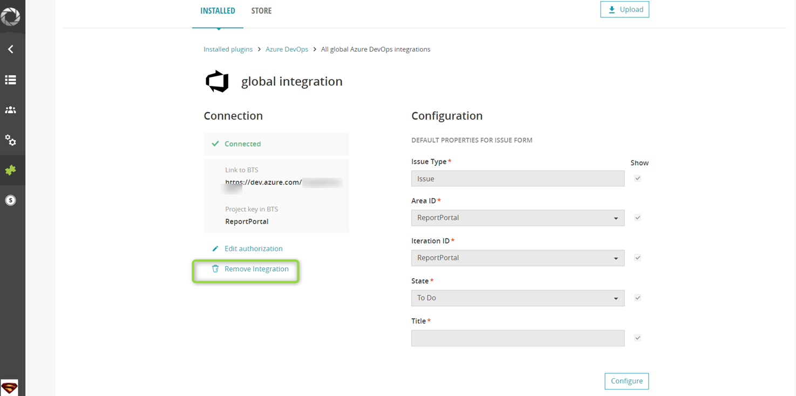

6. Submit the action.

## Project Azure DevOps BTS integration

### Add new project Azure DevOps BTS integration

If any project needs different Azure DevOps BTS configurations, you should unlink a project from Global configurations and add a Project configuration. It means that now when a new global integration is added to the ReportPortal, it won't be applied to the unlinked project.

For that,

1. Log in as an ADMIN or Project Manager.

2. Go to Project Settings > Integrations.

3. Click on the Azure DevOps integration panel.

4. Click on “Unlink and setup manually” button.

5. Fill and confirm the authorization form.

>**Note:**
Please, have a look at **Global Azure DevOps BTS** integration for detailed configuration steps.

You can choose predefined Azure DevOps ticket fields after you have created a connection with the Azure DevOps BTS project. These fields will be shown to you all the time when you post an issue to the Azure DevOps BTS.

This feature also gives you the ability to choose proper issue type for newly created issues in Azure DevOps BTS.

To choose a needed issue type and predefined field for the chosen issue, you should perform the following actions on the opened **Configuration** form:

1. Choose issue type from the drop-down.

2. Check the needed fields and fill them in if necessary.

3. Click on “Submit” button.

Now team members on this project will be able to submit issues in Azure DevOps BTS. Options for Post Issue/Link issue are activated.

You can add more integrations by clicking on “Add integration” button.

### Reset to project Azure DevOps BTS Integrations

If you want to delete project integrations with Azure DevOps BTS and link your project with global configurations, please perform actions described below:

1. Log in as an ADMIN or Project Manager.

2. Go to Project Settings > Integrations.

3. Click on the Azure DevOps integration panel.

4. Click on “Reset to global settings” button.

5. Confirm the action.

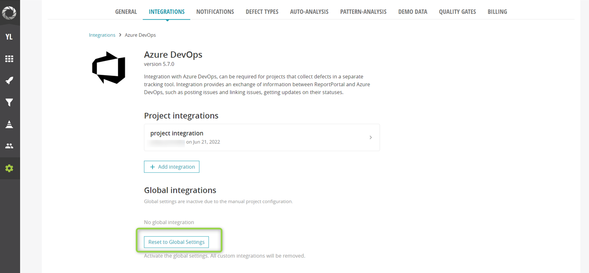

## Post issue to Azure DevOps BTS

Posting an issue to Azure DevOps BTS means creating a new issue in Azure DevOps BTS from ReportPortal and uploading logs and attachments from an execution.

If you want to post a new issue to Azure DevOps BTS, you need to have a project or global integration with Azure DevOps BTS.

1. Log in to ReportPortal as Admin, PM, Member, Customer or Operator.

2. Go to Launches.

3. Choose a needed item.

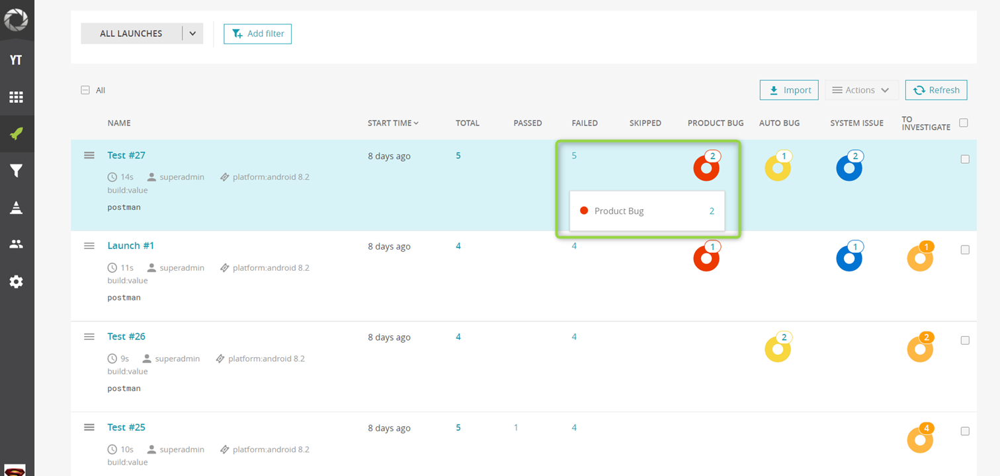

4. Click on the pencil icon to open “Make decision” modal.

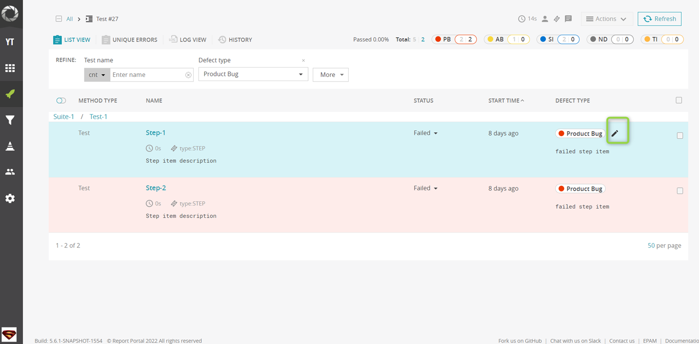

5. Choose “Post issue” option and then “Apply & Continue”.

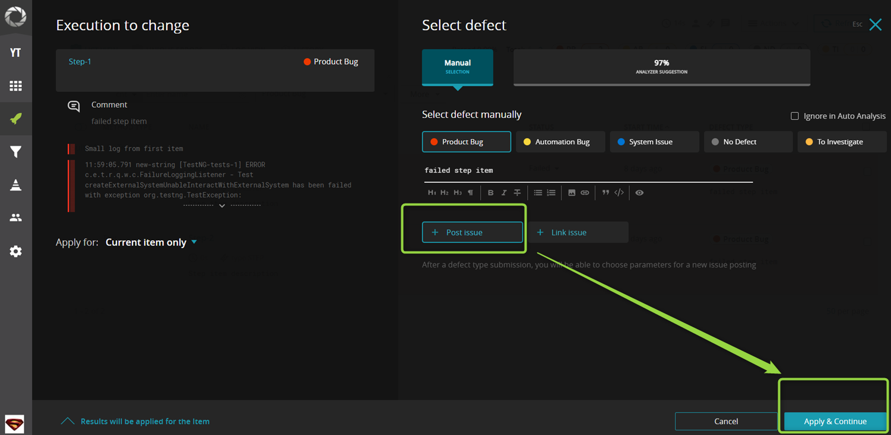

6. Fill in the “Post Issue” form with valid data and submit the form.

7. A new issue will be posted in Azure DevOps BTS with information from ReportPortal.

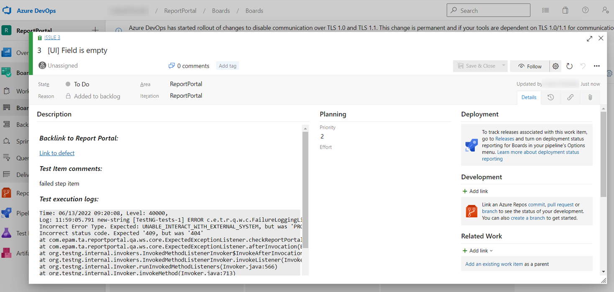

8. A label with issue ID will be added to the test item.

## Link an issue with an issue in Azure DevOps BTS

Linking an issue with an issue in Azure DevOps BTS means adding a clickable link to an existing issue in Azure DevOps BTS from ReportPortal that will show a status of this issue.

1. Log in to ReportPortal as Admin, PM, Member, Customer or Operator.

2. Go to Launches.

3. Choose a needed item.

[ 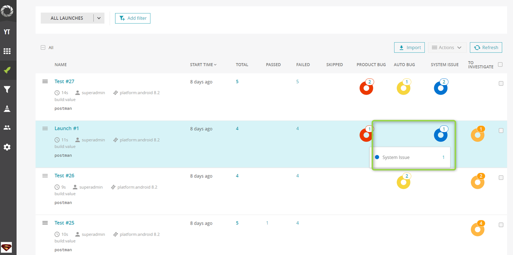

4. Click on the pencil icon to open “Make decision” modal.

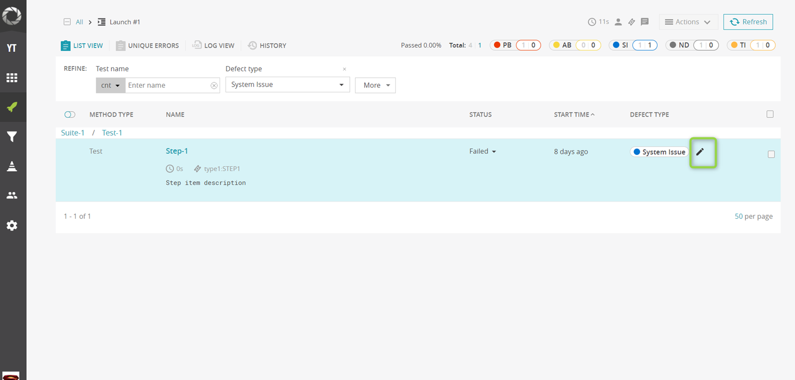

5. Choose “Link issue” option and then “Apply & Continue”.

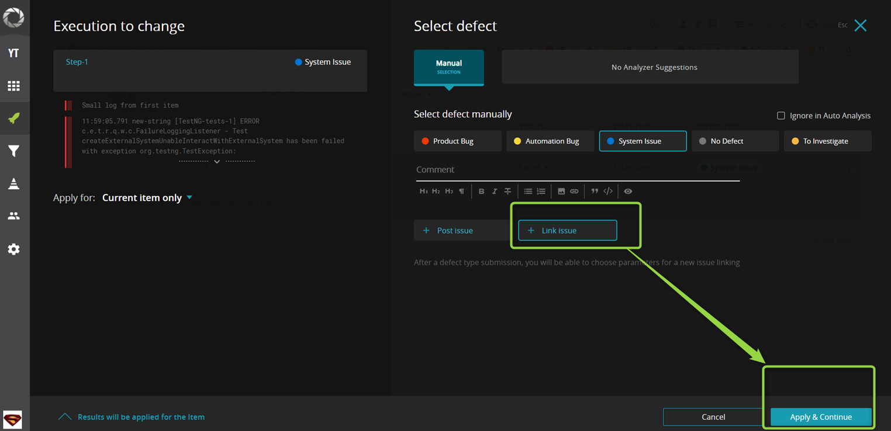

6. Fill in the “Link issue” form with valid data and submit the form.

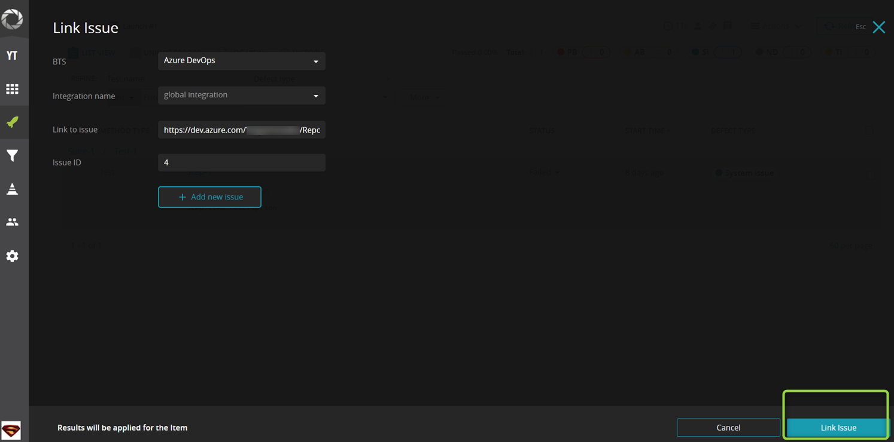

7. A label with issue ID will be added to the test item.

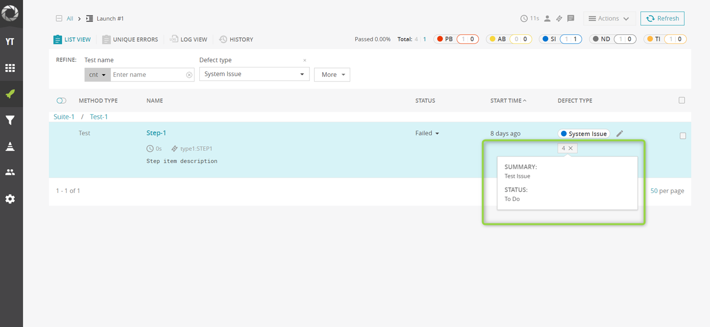

8. Link is redirected to this issue in Azure DevOps BTS.

## Unlink an issue in Azure DevOps BTS

You can also unlink an issue.

1. Click on the “remove” icon.

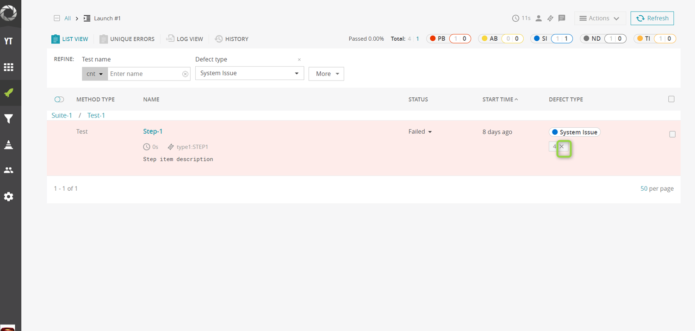

2. Click “Unlink Issue”.

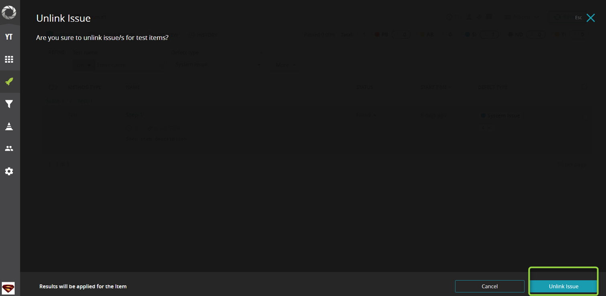

3. Link to the issue in Azure DevOps BTS is removed.

## Custom issue type in Azure DevOps BTS

You can configure any custom issue type (e.g., Bug for Adam) in Azure DevOps BTS and then choose it as predefined Azure DevOps ticket field. So, developer Adam will see on the Azure DevOps BTS all issues from ReporPortal which assigned to him.

Follow the steps below to configure custom issue type:

1. Log in to [Azure portal](https://dev.azure.com).

2. Go to Organization settings.

3. Click on the “Process” menu item.

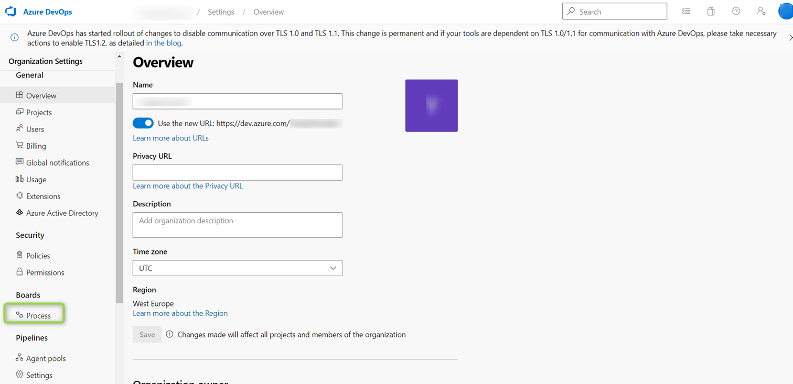

4. Select three dots near the current process and create a new one.

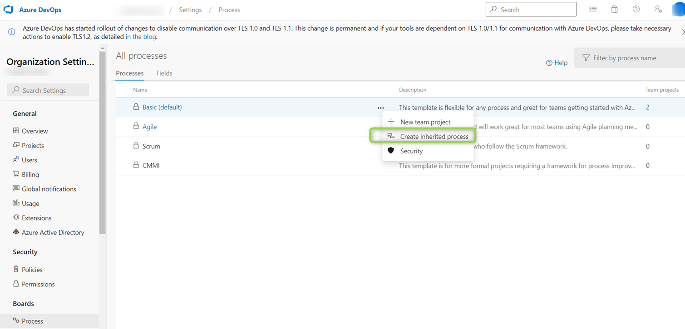

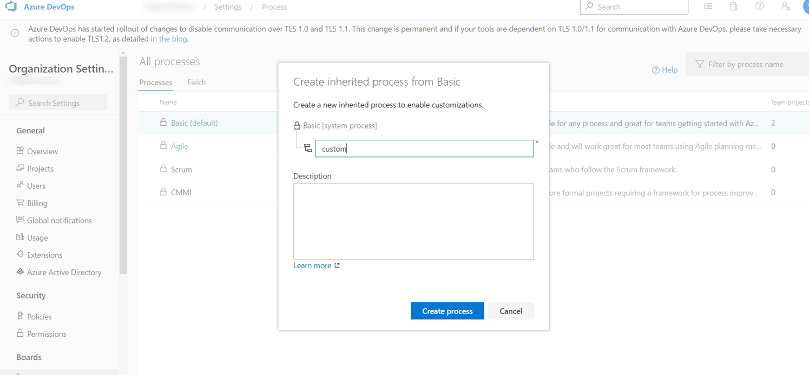

5. Click on the name of the just created process.

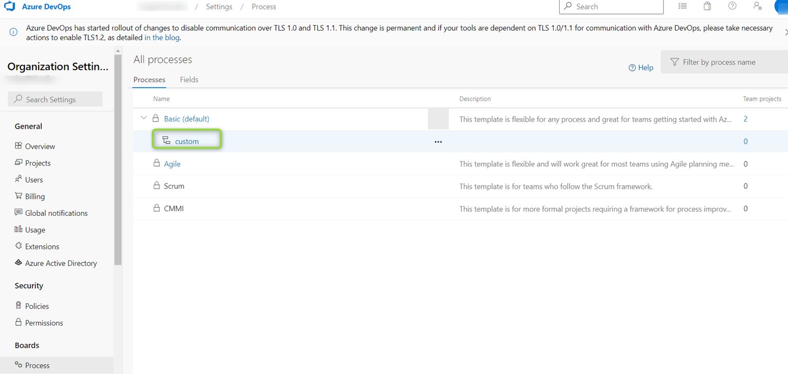

6. Create custom issue type.

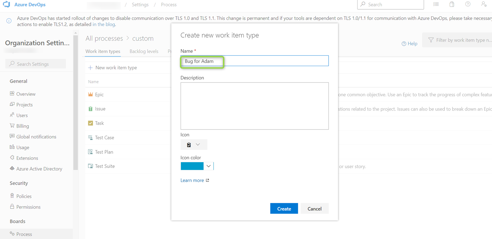

7. Click on the project quantity and change the process for your project.

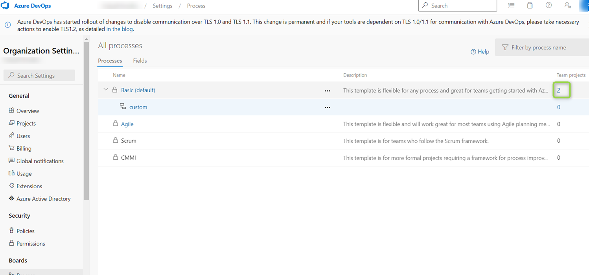

8. Change Issue Type for Azure DevOps BTS integration on ReportPortal.

9. Post issues to Azure DevOps BTS.

10. Now you can see issues with custom issue type on Azure DevOps BTS.

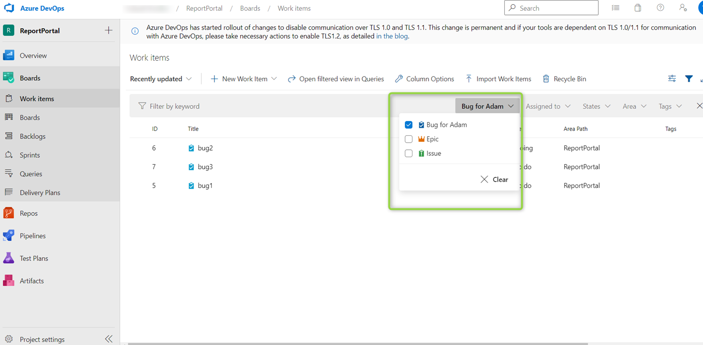