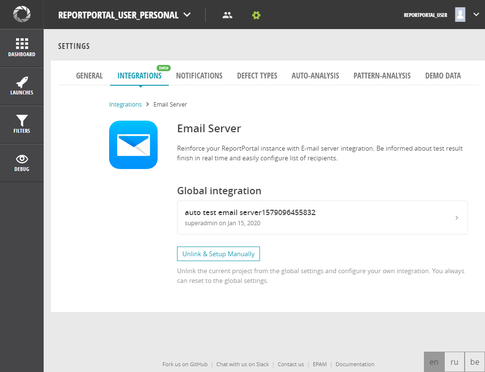

# E-mail server
## Add E-mail server integrations

You can integrate the Report portal with an E-mail server. With this integration, you will be able to perform such functions as:

- invite a new user to the project
- configure notification rules on launch finish


**Permissions:**

user with account role *ADMINISTRATOR* can configure E-mail integration for the whole instance or per project.
User with account role *PROJECT MANAGER* can configure E-mail integration only on a project where he is assigned on as Project Manager.

## Global E-mail server integration

To configure the Email server for the whole instance:

1. Log in to the ReportPortal as an ADMIN user

2. Then open the list on the right of the user's image.

3. Click the 'Administrative' link

4. Click the 'Plugins' from the left-hand sidebar

5. Click on the 'Email Server' tab.

6. Click on Add new integration

7. The next fields should be present:

```javascript 
`Host`: <host_name_of_email_server>
`Protocol`: SMTP (predefined)
`Default sender name`: (optional)
`Port`: <port_number>
`Authorization`: OFF/ON 
`Username`: <user_email_address>
`Password`: <user_email_password>
'TLS' or 'SSL': should be checked depends on the selected port.
```

Example of email server configuration for Gmail email server (detailed info could be found [here](https://support.google.com/a/answer/176600?hl=en))

```javascript
`Host`: smtp.gmail.com
`Protocol`: SMTP
`Default sender name`: Report Portal
`Port`: 465
`Authorization`: ON
`Username`: <user_email_address>
`Password`: <user_email_password>
`SSL`: checkbox should be checked.
```

Example of an email server configuration for a Yandex email server (detailed info can be found [here](https://yandex.com/support/mail-new/mail-clients.html))

```javascript
`Host`: smtp.yandex.com
`Protocol`: SMTP
`Default sender name`: Report Portal
`Port`: 465
`Authorization`: ON
`Username`: <user_email_address>
`Password`: <user_email_password>
`SSL`: checkbox should be checked.
```

8. Confirm data in the form

[  ](https://youtu.be/FekmJRNedfU)

After E-mail server integration adding, the configuration will be applied to all projects on the instance.

**Project E-mail integration**

If E-mail integration has not to be added on the project, or if Project Manager or Admin want to specified special configurations for a special project, they can configure E-mail server in the project settings.

To configure Email server for one single project instance:

1. Log in to the ReportPortal as an ADMIN or PM user
2. Then click on the Project settings icon.
3. Click on the Integrations tab.
4. Click on the 'E-mail Server' tab.
5. Click on the button "Unlink & Setup Manually"
6. The next fields should be present:
```javascript 
`Host`: <host_name_of_email_server>
`Protocol`: SMTP (predefined)
`Default sender name`: (optional)
`Port`: <port_number>
`Authorization`: OFF/ON 
`Username`: <user_email_address>
`Password`: <user_email_password>
'TLS' or 'SSL': should be checked depends on the selected port.
```

Example of email server configuration for Gmail email server (detailed info could be found [here](https://support.google.com/a/answer/176600?hl=en))

```javascript
`Host`: smtp.gmail.com
`Protocol`: SMTP
`Default sender name`: Report Portal
`Port`: 465
`Authorization: ON
`Username`: <user_email_address>
`Password`: <user_email_password>
`SSL`: checkbox should be checked.
```

Example of an email server configuration for a Yandex email server (detailed info can be found [here](https://yandex.com/support/mail-new/mail-clients.html))

```javascript
Host: smtp.yandex.com
`Protocol`: SMTP
`Default sender name`: Report Portal
`Port`: 465
`Authorization`: ON
`Username`: <user_email_address>
`Password`: <user_email_password>
`SSL`: checkbox should be checked.
```

8. Confirm data in the form

After E-mail server integration adding, the configuration will be applied to all projects on the instance.

>**Note:** In case you unlink your project settings from Global settings, for the chosen project

**A possibility to provide custom host in links** (started from 5.4 version)

You can make this operation via API.
For that just choose an API call Integration controller - Update project integration instance, and provide a link to your host in the field  ' "rpHost": "custom_link.com" ''

```javascript
PUT/v1/integration/{projectName}/{integrationId}

{
 "enabled": true,
 "integrationParameters": {
 "protocol": "smtp",
 "rpHost": "custom_link.com",
 "authEnabled": true,
 "port": "",
 "sslEnabled": false,
 "starTlsEnabled": true,
 "host": "smtp.com",
 "username": ""
 }
}
```
