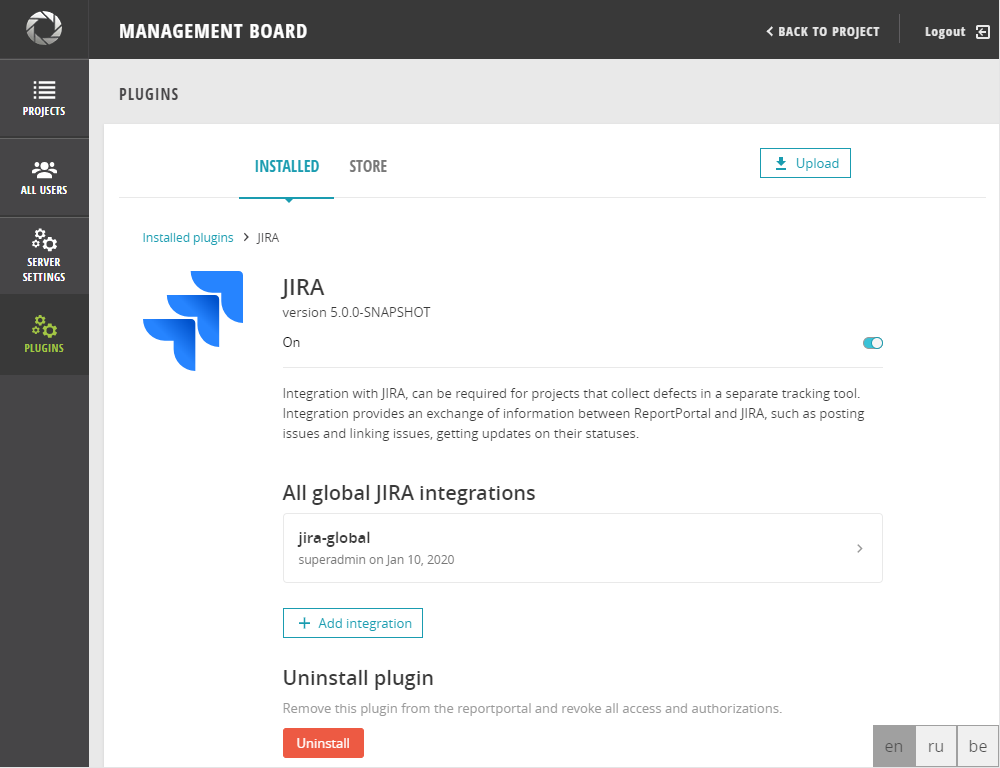
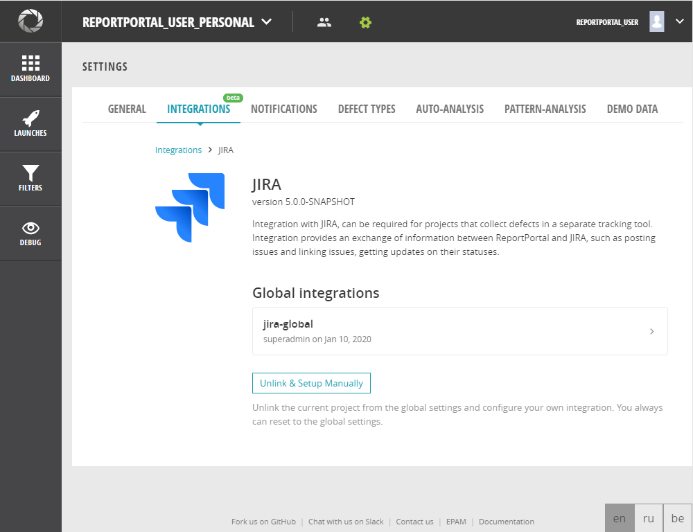
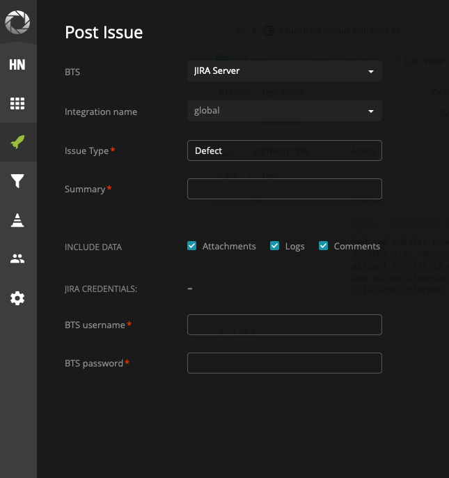
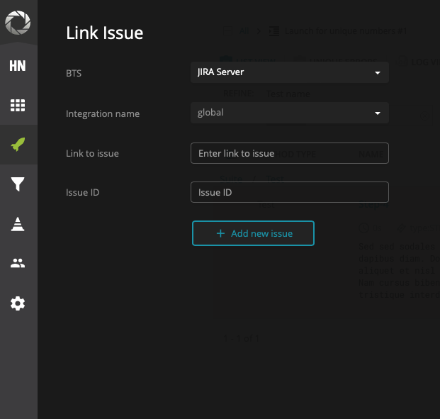

# Jira Server

For Jira Server plugin installation please check [documentation](./ManagePlugins#upload-plugin)

Integration with the JIRA Server can be required for projects that collect defects in a separate tracking tool. The integration provides an exchange of information between ReportPortal and the JIRA Server, such as posting issues and linking issues, getting updates on their statuses.

**Permission:**

The *Administrator* can upload a plugin and create global integrations on the Plugin tab in the Administrate section. Also, the Administrator can unlink project configurations from global.
The *Project Manager* can work only on the project level. He can unlink and re-write global configuration with project ones on Project Settings > Integrations.

## Global JIRA Server integration

### Add new global Jira Server integration

If all projects on your instance are using the same Jira projects, you will be able to configure **global integrations** which will be applied on all projects.

1. Log in as ADMIN

2. Go to Administrative > Plugins

3. Click on JIRA Server plugin panel

4. Click on "Add integration" button

5. Fill and confirm the authorization form

```javascript
'Integration Name': <The name which you want to give to your integration> - should be unique
'Link to BTS': <valid URL of bug tracking system>
'Project key in BTS': <project key in bug tracking system>            
'Authorization Type': Basic (predefined)                  
'BTS Username': <JIRA user name>                  
'BTS Password': <JIRA user password>
```

After you have created a connection with the JIRA project, you can choose predefined JIRA ticket fields. These fields will be shown to you all the time when you post the issue in Jira.

This feature gives you the ability to choose which type you will post a ticket.

To choose a needed issue type and predefined field for the chosen issue, you should perform the following actions:

1. Click on "Configure" button

2. Choose issue type from the drop-down

3. Check the needed fields and fill them in if necessary

4. Click on "Submit" button


Now team members on all your projects will be able to submit issues in Jira. Options for Post Issue / Link issue are activated.

[](https://youtu.be/tCRh30KDpKc)

You can add more integrations by clicking on "Add integration" button.

User can add several integrations, but with a different name to the **one JIRA project**.

>**Use case:**
>
> **Situation:** User wants to post to JIRA Server issues with type **Defect** and **Task** to the project NNN-MMM in Jira. Is it possible?
> Yes!
>
> **Solution:** Add two integrations to the project NNN-MMM in Jira with names f.e. "Project -1" and "Project -2".
> Add to the "Project -1" issue type **Defect** and for "Project -2" - issue type **Task**.
> While posing issue procedure, choose integration with needed type.
>
> [](https://youtu.be/med4tuL4plU)

### Update global Jira Server integration

If you need to edit Jira Server integration authorization parameters, please perform actions:

1. Log in as ADMIN

2. Go to Administrative > Plugins

3. Click on JIRA Server plugin panel

4. Click on a tab with existing integration

5. Click on "Edit authorization" link

6. Change "Integration name"

7. Type your Jira Server credentials

8. Submit the form

>**Note:**
>
> You can edit the "Integration name" only. If you need other changes, please submit new integration.


If you need to edit fields which should be posted in Jira Server, please perform actions:

1. Log in as ADMIN

2. Go to Administrative > Plugins

3. Click on JIRA Server plugin panel

4. Click on a tab with existing integration

5. Click on "Configure" button

6. Choose issue type from the drop-down

7. Check the needed fields and fill them in if necessary

8. Click on "Submit" button

[  ](https://youtu.be/yvYwxs4zTYA)

### Remove global Jira Server integration

If you need to remove Jira Server integration, please perform actions:

1. Log in as ADMIN

2. Go to Administrative > Plugins

3. Click on JIRA Server plugin panel

4. Click on a tab with existing integration

5. Click on "Remove integration"

6. Submit the action

[  ](https://youtu.be/mEWP4txdJFA)


## Project JIRA Server integration

### Add new project Jira Server integration

If any project needs different Jira Server configurations, you should unlink a project from Global configurations and add a project configuration. It means that now when a new global integration is added to the ReportPortal, it won't be applied to the unlinked project.

For that,

1. Log in as an ADMIN or Project Manager

2. Go to Project Settings > Integrations

3. Click on the JIRA Server integration panel

4. Click on "Unlink and setup manually" button

5. Fill and confirm the authorization form

```javascript
'Integration Name': <The name which you want to give to your integration> - should be unique
'Link to BTS': <valid URL of bug tracking system>
'Project key in BTS': <project key in bug tracking system>            
'Authorization Type': Basic (predefined)                  
'BTS Username': <JIRA user name>                  
'BTS Password': <JIRA user password>
```

After you have created a connection with the JIRA project, you can choose predefined JIRA ticket fields. These fields will be shown to you all the time when you post the issue in Jira.

This feature gives you the ability to choose which type you will post a ticket.

To choose a needed issue type and predefined field for the chosen issue, you should perform the following actions:

1. Click on "Configure" button

2. Choose issue type from the drop-down

3. Check the needed fields and fill them in if necessary

4. Click on "Submit" button


Now team members on **this project** will be able to submit issues in Jira. Options for Post Issue / Link issue are activated.

You can add more integrations by clicking on "Add integration" button.

[](https://youtu.be/tCRh30KDpKc)

### Reset to project Jira Server Integrations

If you want to delete project integrations with Jira Server and link your project with global configurations, please perform actions described below:

1. Log in as an ADMIN or Project Manager

2. Go to Project Settings > Integrations

3. Click on the JIRA Server integration panel

4. Click on "Reset to global settings" button

5. Confirm the action

[  ](https://youtu.be/KIrEVY-DKiA)


## Some tricks when you create a new connection:

1. Verify that the link to the JIRA Server system is correct. There are several possible variants are possible, for instance: https://jira.company.com/jira https://jiraeu.company.com

2. Verify the project key in JIRA Server is correct. Please fill in the Project key field with project key-value, e.g. project ABC-DEF has key ABCDEF.

3. Verify the username and password data. Make sure, that the login name and not the email are in the username field. In case all the data above is correct, but the error appears again, check whether the user's credentials to JIRA Server are not expired. As far as JIRA Server sends the request in HTML format, we are not able to display the real reason for the error. To check and/or resolve the issue, please do the next steps:

    *    Open JIRA Server page
    *    Log in to JIRA Server with domain credentials using basic authorization (i.e., fill in user's login name and password into the fields)
    *    Submit the login form Screen with CAPTCHA should appear
    *    Enter the symbols
    *    Submit the credentials again
    *    Now try to establish the connection to JIRA Server on the ReportPortal project.

4. SSL instance of JIRA (even cloud version) can be accessed by JIRA API token, used instead of a password.
   After you have connected Jira and ReportPortal, you can choose an issue type that you will be able to add to Jira during the “Post Issue” operation.  Also, the user can add predefined fields that the user can fill.

## Post issue to Jira Server

Posting an issue to Jira Server means to create a new issue in Jira from ReportPortal and upload logs and attachments from an execution.

If you want to post a new issue to Jira, you need to have a project or global integration with Jira Server.



Post issue via Step view

1. Log in to ReportPortal as Admin, PM, Member, Customer or Operator

2. Go to a Step view

3. Choose a needed item

4. Click on "Actions" button

5. Choose "Post issue" option

6. Fill in the "Post issue" form with valid data

```javascript
`BTS`: if you have configured BTS integrations, you will be able to choose between them
`Integration name`: from the drop-down, you can choose any of integrations for chosen earlier BTS
`Predefined fields`: fields which you choose on Project Settings/ or Plugins
`Included data`: which data should be posted to BTS (attachments, logs, comments)
`BTS username`: reporter login in Jira Server
`BTS password`: reporter password in Jira Server
```

7. Submit the form

8. A new issue will be posted in BTS with information from ReportPortal

9. A label with issue ID will be added to the test item


## Link an issue with an issue in Jira Server

Linking an issue with an issue in Jira Server means adding a clickable link to an existing issue in Jira from ReportPortal that will show a status of this issue.



Link issue via Step view

1. Log in to ReportPortal as Admin, PM, Member, Customer or Operator

2. Go to a Step view

3. Choose a needed item

4. Click on "Actions" button

5. Choose "Link issue" option

6. Fill in the "Link issue" form with valid data

```javascript
`BTS`: if you have configured BTS integrations, you will be able to choose between them
`Integration name`: from the drop-down, you can choose any of integrations for chosen earlier BTS
`Link to issue`: a full link to the item in BTS
`Issue ID`: information which will be displayed on the label in ReportPortal
```

7. Submit the form

8. A label with issue ID will be added to the test item
