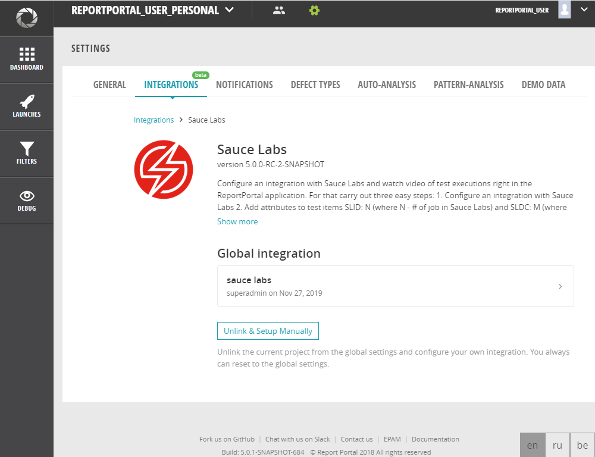

# Sauce Labs

For SauceLAbs plugin installation please check [documentation](https://reportportal.io/docs/Plugins%3Eupload-plugin)

## Add Sauce Labs integrations

Configure integration with Sauce Labs and watch a video of test executions right in the ReportPortal application.


**Permissions:**

user with account role *ADMINISTRATOR* can configure integration for the whole instance or per project.
User with account role *PROJECT MANAGER* can configure integration only on a project where he is assigned on as Project Manager.

## Global Sauce Labs integration

To configure Sauce Labs for the whole instance:

1. Log in to the ReportPortal as an ADMIN user

2. Then open the list on the right of the user's image.

3. Click the 'Administrative' link

4. Click the 'Plugins' from the left-hand sidebar

5. Click on the'Sauce Labs' tab.

6. Click on Add new integration

7. The next fields should be present:

```javascript 
`User name`: <host_name_of_email_server>
`Access token`: <youe access token>
`Data center`: <Europe, USA>
```

8. Confirm data in the form

After Sauce Labs integration adding, you can use Sauce Labs integration.


## How to use Sauce Labs Integration

Before using this feature a user should report test results to ReportPortal with the attribute:`SLID: XXXXXXXX`.

Where SLID - `Sauce Labs ID`

XXXXXXXX - `# of job in Sauce Labs`

By the attribute `SLID: XXXXXXXX` you link the execution in ReportPortal and a job in Sauce Labs.

So that if a test item has an attribute `SLID: XXXXXXXX`, and there is a global or project integration with Sauce Labs, a user will be able to view a video from Sauce Labs from the appropriate job in ReportPortal on a log view.

[](https://youtu.be/RQAxGz6koh0)
