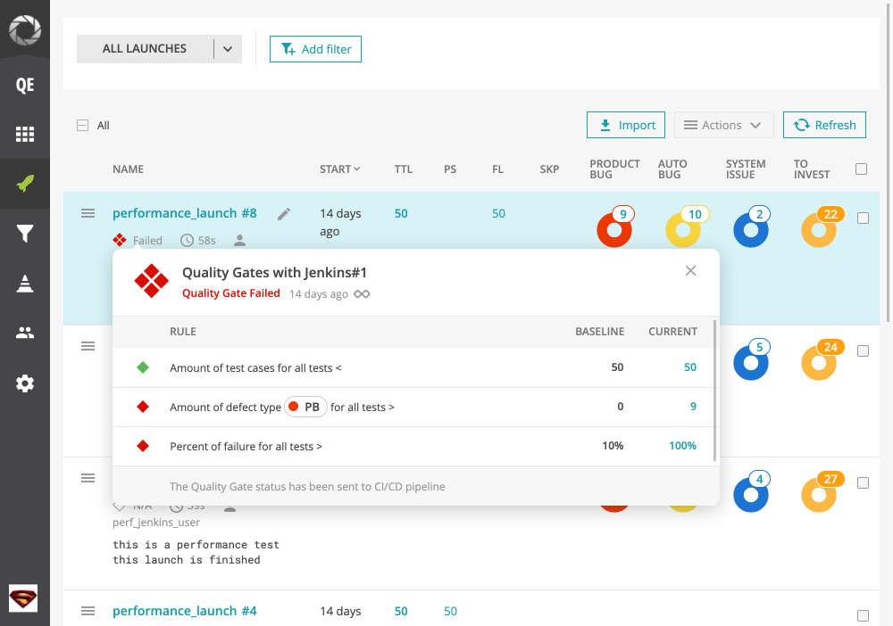

# Assessment of test results using Quality Gates

Now the system is preconfigured, and you can start using Quality Gates Analysis.

Quality Gates plugin can be used with CI/CD tools - in this case, and Quality Gate status will be sent to CI/CD pipeline.
But also, Quality Gates can be used just as a way of test results analysis.

First, let's discuss how Report Portal assess a test run quality and provide a full report with results.
Second, let's check how to send assessment results to CI/CD.

## Quality Gate Analysis

## How to run Quality Gates Manually

By default, all launches have "N\A" status. It means that Quality Gate analysis has not been run for these launches.

If you want to run Quality Gate analysis manually, click on the label "N/A" and click on the "Run Quality Gate" in the opened pop-up.

## How to recalculate Quality Gates

If you want to recalculate Quality Gate status for a launch, just perform next actions:

* click on ```the label with a status``` of a launch
* click on the ```"Recalculate"``` in the opened pop-up


Quality Gates can not be run for launches in progress.

>**Note:** If Quality Gate status has been alredy sent to CI/CD, a status can not be recalculated for a such launch.
> 

## How to run Quality Gates Automatically

You can configure Auto Quality Gate Analysis on the Project Settings. If you switch Quality Gate Analysis ON, the system will start QG analysis on the launch finish.


## Quality Gate Status and Timeout

When a launch finishes, the system starts Quality Gate Analysis.

**First,** the system checks if there Quality Gate for a launch under analysis. If there is no, such Quality Gate, the system shows error message.
**Second,** if Quality Gates is found, the systems checks all rules in Quality Gate one by one and define a status for each rule
**Third,** if all rules are done, the system defines the status of a whole Quality Gate.

How is status calculated:

| Status | Calculation| Meaning |
| :----:      |:----:   |:----:   |
| Passed | All rules in a Quality Gate have status PASSED| Quality Assessment passed, a test run matches specified quality criteria  |
| Undefined| If Quality Gate does not have FAILED, IN PROGRESS rules, but at least one rule has status Undefined| Quality Assessment can not be finished :question: |
| In Progress| If Quality Gate does not have FAILED rules, but at least one rule in a Quality Gate has status IN PROGRESS| Quality Assessment is in progress |
| Failed | At least one rule in a Quality Gate has status FAILED| Quality Assessment failed, a test run does not match specified quality criteria |

**Forth,** if there is an integration with CI/CD, the system sends status to CI/CD tools to a pipeline.

:question: The reasons why Quality Gates can get a status **Undefined**:
* For "Amount of issues" rule: if a number of To Investigate issues in the analyzed launch is more than allowable To Investigate level
* For "New Failure": if a baseline is not found in the system

If you get this status, you can proceed with launch analysis (or choose another baseline) and rerun Quality Gates. For that check the section ### How to recalculate Qulaity Gates.

### Timeout
Specially for integration with CI\CD, Quality Gates has parameter ```Timeout```. If a launch whose status should be sent to a pipeline, gets UNDEFINED status, the system uses a value from ```Timeout```. Default ```Timeout``` equals to 2 hours. It means, that after 2 hours after launch finish, the system force recaluculats Quality Gate Status and defined status.

| Jenkins Job Status | Quality Gate Status | Description              |
| :----:      |    :----:   | :---                                    |
| SUCCESS     | PASSED      | All Rulles Passed                 |
| FAILED      | FAILED      | At least one rule does not pass                |	

If you want to choose other options for a timeout, you can do it:

* Login ReportPortal as Project Manager or Admin
* Open ```Project Settings> Quality Gates```
* Click on ```the pencil``` on the Quality Gate rule
* Click on ```"Edit Details."```
* Choose needed option in a dropdown ```"Timeout"```
* Save a Quality Gate

If there is no needed option in the dropdown, you can specify custome value via API.

## Quality Gate Report

A Quality Gate report is a full report that shows information on Quality gate results. This is a table that shows:

* all rules in a Quality Gate
*  rule status: ```Passed/Faile/Skipped```
*  expected results
*  actual results


All actual results are clickable in the report except New Failure. A clickable area for New failure will be available in the version 5.7. So user can drill down and investigate items, that became a reason of build failure.
