# Quality Rules Configuration

Now let's configure the Quality rule, which will be used for launch quality assessment.

## Quality Gate creation
Quality Gates can be configured on the Project Settings on the tab Quality Gate.

The Project Manager or Admin can create several rules for one project.

For Quality Gate creation Project Manager or Admin should:

* Open ```Project Settings> Quality Gates```
* Click on the ```Create Gate``` button
* In ```Create Quality Gate``` fill in the form
* Click on the button ```"Save"```
* A Quality Gate is created successfully
* Quality Gate is added to the Quality Gate List

```groovy
Quality Gate Name: (Min length 1 - max length 55) A name that will be added to the Quality Gate report on All launches
Analyzed Launch: Launch Name of a launch that should be analyzed   
Attributes: key: value AND key:value AND key:value (example = build: 5.0 AND device: MacOS AND test plan: Regression) 
```

[](https://youtu.be/dXp3Lf9bI30)

## Quality Gate ordering


## Quality Gate rules

When Quality Gate is created, you can fill your gate with quality rules.

There are four types of Quality Gate rules:
* Amount of tests
* Amount of issues
* Percent
* New failures
* New errors (from version 5.7)

### Amount of tests in the run

>**Case:** Regression suite has 224 tests. You want to track that all tests should be run every time.

[](https://youtu.be/TC0J8BV_XBY)

The purpose of the rule is to block a run that contains not all tests so that you can define the minimum number of tests that should be in the run.

For adding this rule Project Manager or Admin should:

1.  Open ```Project Settings> Quality Gate```
2.  Click on ```the pencil``` on the Quality Gate
3.  Click on the drop-down: ```"Add a new rule"```
5.  Choose the option ```"Amount"```
6.  Choose the option ```"All tests"```
7.  Add a number of min allowable amount of tests in the launch - ```N```
8.  Click on ```the tick```
9.  The rule is added to the Quality Gate

Now the system will automatically analyze a launch and compare the number of tests in the analyzed launch with the number in the "amount" rule in the Quality Gate. If the number of tests in the launch is less than in the rule, the system fails the rule and Quality Gate.

>**Note:** You can add only 1 "All tests amount" rule to 1 Quality Gate.

**Amount of tests in a component/feature/etc**

>**Case:** Regression suite contains 24 tests with critical priority. You want to track if these tests are executed every time.

[](https://youtu.be/EwsG7RcmcDs)

You can also track the number of tests that belong to a feature, component, priority or others in a launch.
For that, tests in the analyzed launch should have attributes (f.i. feature: Payment, or component: Payment, or priority: critical, or any others).

Then you need to add an "amount" rule with an attribute option:

1.  Open ```Project Settings> Quality Gate```
2.  Click on ```the pencil``` on the Quality Gate
3.  Click on the drop-down: ```"Add a new rule"```
4.  Choose the option ```"Amount"```
5.  Choose option ```"Tests with attributes"```
6.  Add a number of min allowable amount of tests for the component, feature etc. - ```N```
7.  Click on ```the tick```
8.  The rule is added to the Quality Gate

Now the system will automatically analyze a launch and compare the number of tests with specified attributes in the analyzed launch with a number in the "amount" rule in the Quality Gate. If the number of tests is less than in the rule, the system fails the rule and Quality Gate.

>**Note:** You can add several "Tests with attribute amount" rules to the Quality Gate. But it is impossible to create duplicates.


### Failure rate of the run

>**Case 1:** You want to track that the passing rate for regression suite should be no more than 20%.
>
>**Case 2:** You want to track that all critical tests in regression suite are always passed.

[](https://youtu.be/bSO21gtT82E)

The purpose of the rule is to block a run that has a not allowable passing rate so that you can define the minimum failure rate for the run.

**Launch Failure rate**

For adding this rule Project Manager or Admin should:

1.  Open ```Project Settings> Quality Gate```
2.  Click on ```the pencil``` on the Quality Gate
3.  Click on the drop-down: ```"Add a new rule"```
4.  Choose the option ```"Percent"```
5.  Choose the option ```"All tests"```
6.  Add a % of min allowable failure rate - ```N%```
7.  Click on ```the tick```
8.  The rule is added to the Quality Gate

On the finish, the system will automatically analyze a launch and compare failure rate in the analyzed launch with % in the "failure per cent" rule in the Quality Gate. If the failure rate in the launch is more than in the rule, the system fails the rule and Quality Gate.

>**Note:** How a failure rate is calculated
>
> ```Failure rate``` = items with type STEP with status FAILED / ALL items with type STEP in the analyzed launch

You can add only 1 "All tests failure rate" rule to 1 Quality Gate.

**Failure rate in a component/feature/etc**

You can also track the failure rate of tests that belong to a feature, component, priority or others in a launch.
For that, tests in the analyzed launch should have attributes (f.i. feature: Payment, or component: Payment, or priority: critical, or any others).

Then you need to add an "amount" rule with an attribute option:

1.  Open ```Project Settings> Quality Gate```
2.  Click on ```the pencil``` on the Quality Gate
3.  Click on the drop-down: ```"Add a new rule"```
4.  Choose the option ```"Percent"```
5.  Choose option ```"Tests with attributes"```
6.  Add a % of min allowable failure rate - ```N%```
7.  Click on ```the tick```
8.  The rule is added to the Quality Gate


In this case, on the finish, the system will automatically analyze a launch and compare the failure rate of tests with a specified attribute in the analyzed launch with failure rate from the rule in the Quality Gate. If the failure rate is more than specified in the rule, the system fails the rule and Quality Gate.

>**Note:** How a failure rate is calculated
>
> ```Failure rate for tests with a attribute``` = items with type STEP with status FAILED and with a specified attribut / ALL items with type STEP in the analyzed launch and with a specified attribut

You can add several "Tests with attribute percent" rules to the Quality Gate. But it is impossible to create duplicates.

**Not passing rate in the launch or a component/feature/etc.**

You can use the "Percent rule" in several options: ```Failure /Not passed```.

The failure rule is described in the previous sections.

If you choose the "Not passed" option, the system will use another calculation method.

>**Note:** How a notpassed rate is calculated
>
> ```Not passed rate``` = items with type STEP with status FAILED and SKIPPED / ALL items with type STEP in the analyzed launch
>
> ```Not passed rate for tests with a attribute``` = items with type STEP with status FAILED and SKIPPED  and with a specified attribut / ALL items with type STEP > in the analyzed launch and with a specified attribut


### Amount of issues in the run

>**Case 1:** You want to track that the regression suite run should not have a critical issue or Product bugs.
>
>**Case 2:** Regression suite contains 500 tests with critical priority. You want to track that the run should not have critical issues or Product bugs (or any other) in these 500 tests.

[](https://youtu.be/ajIvWB83bGg)

Amount of issues also has 2 options "All tests" and "Tests with the attribute". The purpose of the rule is to limit the number of unwanted defects in the run. With the option "All tests", you can restrict issues for all tests in the launch.

With the option "Test with attributes", you can limit issues in the critical features, components, etc.

**Ammount of issues in the launch**

For adding this rule Project Manager or Admin should:

1.  Open ```Project Settings> Quality Gate```
2.  Click on ```the pencil``` on the Quality Gate
3.  Click on the drop-down: ```"Add a new rule"```
4.  Choose the option ```"Amount of issues"```
5.  Choose the option ```"All tests"```
6.  Choose a defect type: ```"Total Defect Types"``` or ```"Defect Type"```
7.  Add a number of min allowable issues - ```N%```
8.  Click on ```the tick```
9.  The rule is added to the Quality Gate

On the finish, the system will automatically analyze a launch and compare a number of specified defects in the analyzed launch with a issues numbers in the "amount issues" rule in the Quality Gate. If the a number of issues in the launch is more than in the rule, the system fails the rule and Quality Gate.

>**Note:** How a number of issues is calculated
>
> if in the rule specified "Total Defect type"
> >
> ```A number of issues in the test run``` = SUM of items with defect types which belong to the Defect type group
>
> if in the rule specified "Defect type"
>
> ```A number of issues in the test run``` = number of items with specified defect types

**Ammount of issues in tests with attribute**

For this rule a user can choose an option ```Tests with an attribute"```. The logic for this rule is the same as for rule "Amount of tests with an attribute".

#### Allowable level of To investigate

When you choose a rule ```"Amount of issues"```, the system automatically adds a parameter ```"Allowable To investigate level"``` to the Quality Gate.

What does this parameter mean?

The purpose of the rule is a check and a guarantee that the run does not contain specified issues. But if a launch includes "To investigate", the system can not make an analysis of the system and guarantee that the forbidden problems are absent in a launch.

For this reason, we have added the parameter ```"Allowable To investigate level"```. By default, this parameter equals 0. But you can change this parameter and set your custom value.

For this Project Manager or Admin can edit Quality Gate:

* Open ```Project Settings> Quality Gates```
* Click on ```the pencil``` on the Quality Gate
* Click on the button ```"Edit Details"```
* Change value in the field ```"Allowable TI"```
* Click on the button ```"Save"```


### New failures in the run


>**Case 1:** Regression suite has 1000 tests. In the last released version, five tests failed in a regression suite. You want to track that the regression runs on the version in development should not have new failures.

>**Case 2:** Regression suite contains 500 tests with critical priority. In the last released version 1 test with critical priority failed. You want to track that critical tests in the regression run on the version in development should not have new failures.

[](https://youtu.be/W05N7DQkalg)

The purpose of the rule is to block a run that has new failures compared to a chosen baseline.

New failures also have 2 options "All tests" and "Tests with an attribute". The purpose of the rule is to block a run that has new failures compared to a chosen baseline.


1.  Open ```Project Settings> Quality Gate```
2.  Click on ```the pencil``` on the Quality Gate
3.  Click on the drop-down: ```"Add a new rule."```
4.  Choose the option ```"New failure."```
5.  Choose the option ```"All tests"/"Test with attributes."```
8.  Click on ```the tick```
9.  The rule is added to the Quality Gate

In this case, on the finish, the system will automatically analyze a launch and compare failed tests /or failed tests with the specified attribute in the analyzed launch with tests in the baseline. It fails a rule if the system detects a new failure in the launch or in tests with specified attributes.

#### How does the rule works

For defining test uniqueness, ReportPortal uses [Test Case ID principles](/work-with-reports/TestCaseId).

>**Note:** For now, ReportPortal can not process items with the same Test Case ID correctly.

#### How to choose a Baseline for the "New failures" rule

**Default Baseline**

By default, a system will use ```a previous launch``` for comparison. For example, for "Launch A #3", the system will use "Launch A #2" as a baseline. If there is no "Launch A #2" (f.e. this launch has been deleted by retention job) in the system, the system will use "Launch A #1".

If there is no fitting launch in the system, the "New failure" rule will get the status "Undefine".


**Customized Baseline**

If you want to choose other options for a baseline, you can do it:

* Login ReportPortal as Project Manager or Admin
* Open ```Project Settings> Quality Gates```
* Click on ```the pencil``` on the Quality Gate rule
* Click on ```"Edit Details."```
* Unclick a checkbox on ```"Choose a previous launch as a baseline."```
* The system activates fields for baseline configuration


| Case | Fileds configuration | 
| :----:      |    :----:   | 
| You want to specify a static launch that should always be used | Select launch name and add launch number in the baseline section|
| You want to specify dynamic launcg| Select launch name and check a button "Latest" :question:|

:question: When you use "latest", the system will use the latest launch with a specified launch name, which has been run before the analyzed launch.
If you want to specify a baseline, you also can add launch attributes. In this case, the system will use the latest launch with specified launch name and attributes, which have been run before the analyzed launch.

### New errors in the run

“Unique errors” functionality with a new Quality Gates rule – New Errors – was implemented in version 5.7. This feature saves your time for searching and analyzing repeated errors in launches. **“New Errors” rule** will help to group errors into new and known ones and, for example, fail build if there are new error not seen previously.

To begin using this functionality, you need to create a Quality Gate and add the “New Errors” rule. Please follow the steps below:

1) Log in to ReportPortal as Admin/PM.

2) Go to ```Project Settings```.

3) Select ```Quality Gates``` section.

4) Click ```Create Quality Gate``` button.

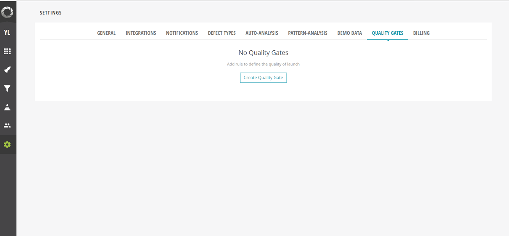

5) Enter ```Quality Gate Name``` and ```Analyzed Launch```, then click ```Save``` button.

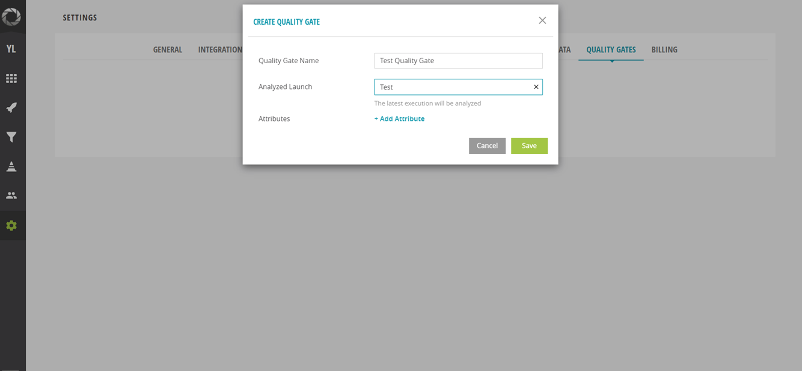

>**Note:** if you want the Quality Gate not to run for all launches, you can adjust it only for the launches with specific attributes. Click ```Add attribute``` and specify value and key, e.g., browser.

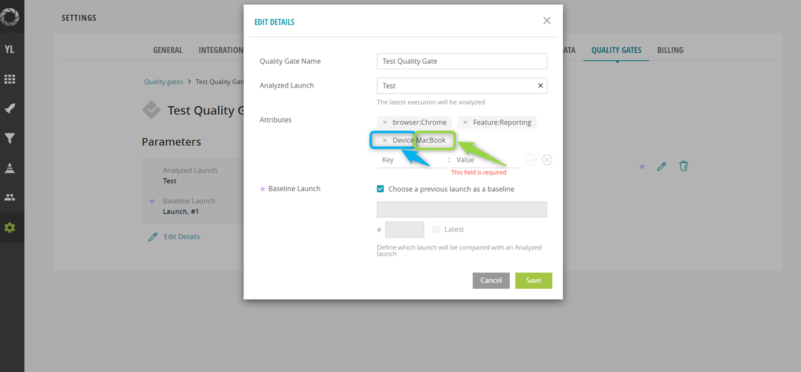

On the example in the screenshot above Quality Gate will run for launches with name **“Test”** with attributes _Browser Chrome_, _Feature Reporting_, _Device MacBook_.

6) Click on the ```Add a new rule``` dropdown and select ```New Errors```.

Click the **“confirm”** icon.

>Please, note that “New Errors” rule can be created with **“All tests”** condition only.

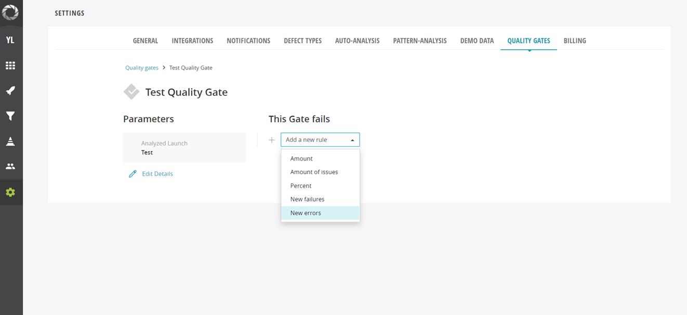

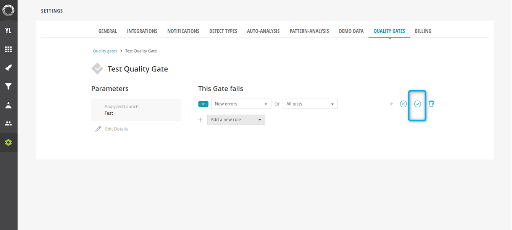

Before running automation tests, make sure that **“Quality Gates”** feature is ON.

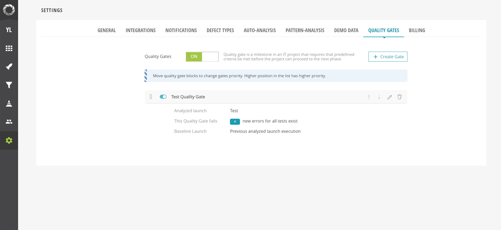

Now everything is ready to use.

7) Go to automation testing tool.

8) Run autotests.

9) Go to ReportPortal.

10) Open the ```Launches``` section and click the ```Refresh``` button at the top.

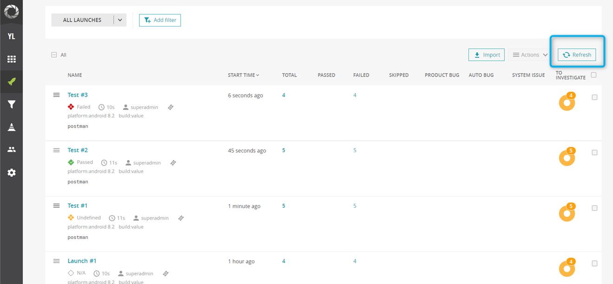

11) Verify the Quality Gates' status.

**_Passed_** - there are no failures.

**_Failed_** - there are new errors.

**_N/A_** - appears if the quality gate was created after a launch was finished, or there is no quality gate for this launch. If the status is Not Available, click on the “N/A” and then click “Run Quality Gate” button (+ “Refresh”).

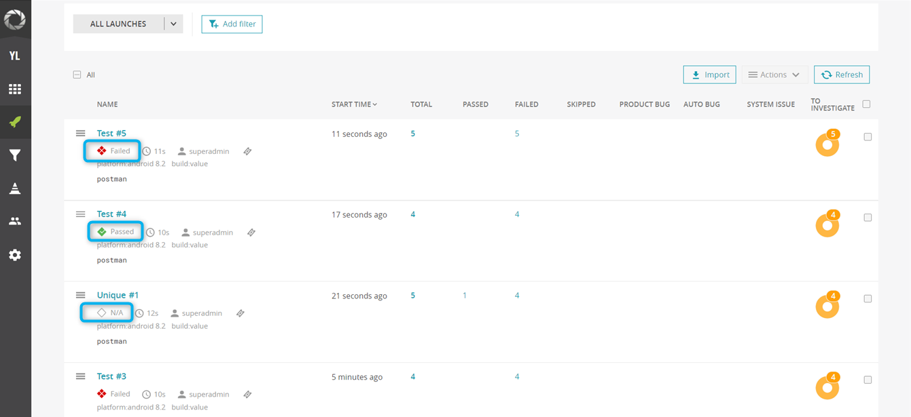

12) To look at the failed test results, click on the ```Failed``` status and then click on the number under ```Current``` column.

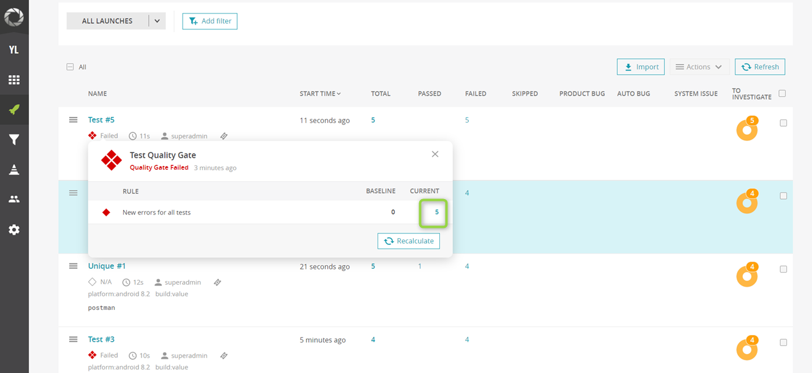

You will be redirected to the ```Unique errors``` tab with a list of all new error logs of the launch. If you want to see known issues as well, open the ```All Unique Errors``` dropdown at the top and click the ```Known Errors``` checkbox.

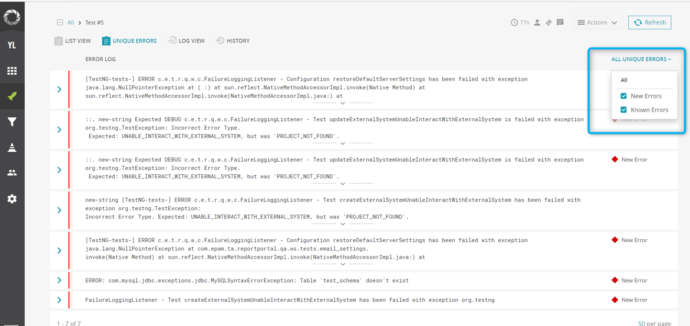

By default, ***a previous launch execution*** is used as a Baseline Launch for the Quality Gate. Besides, you can as well define any other launch by specifying its name and sequence number or select ```Latest``` for the prior run of the specified launch to be used as a baseline.

To make these changes, click ```Edit Details``` on the Quality Gate page and uncheck the ```Choose a previous launch as a baseline``` checkbox.


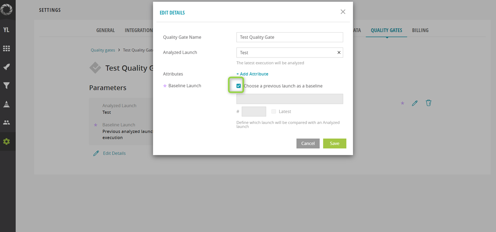

Follow the steps below depending on the preferable settings for the Baseline Launch.

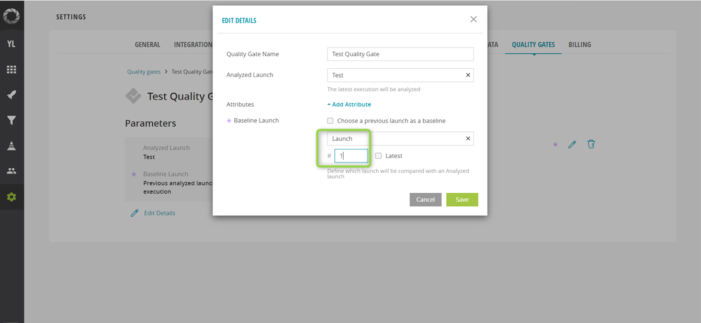


In this way you can compare analyzed launch not only with its previous execution but also with another launch.
