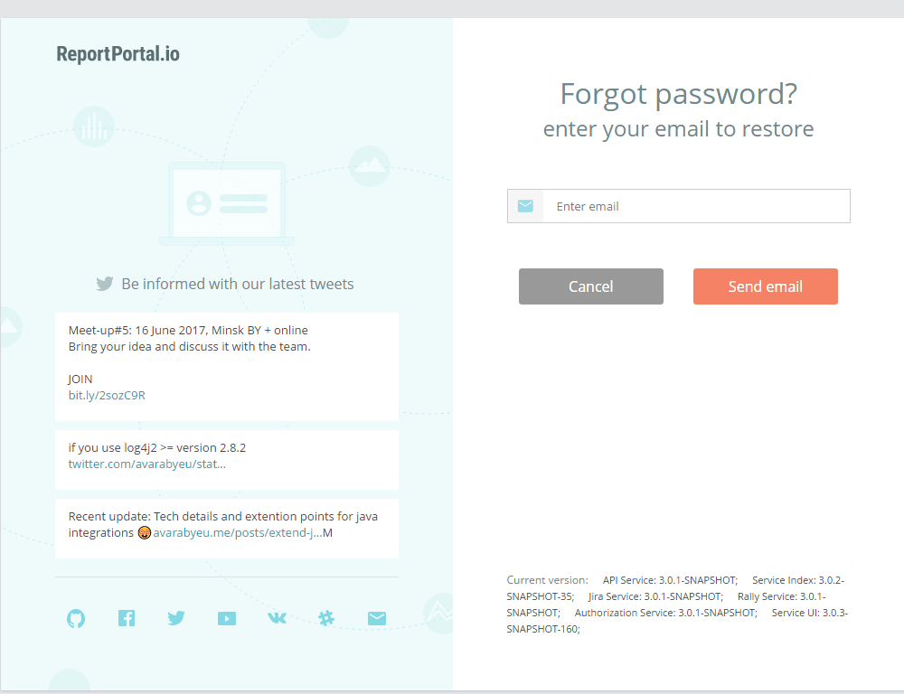

# Restore a password

If you forgot your password, you can restore it on the login page. To do that, perform the following steps:

1. Click the "Forgot your password?" link on the login page.

3. Enter your email in the form that appears and click the "Change Password"
    button. The password recovery instructions will be sent to your email.

4. Follow the link from the email. The Restore Password form will appear.

5. Fill in the restore password form and click the "Change Password" button. Now you can log in ReportPortal with the new 
credentials.

>**Note:**  
GitHub user cannot restore the password on ReportPortal.
