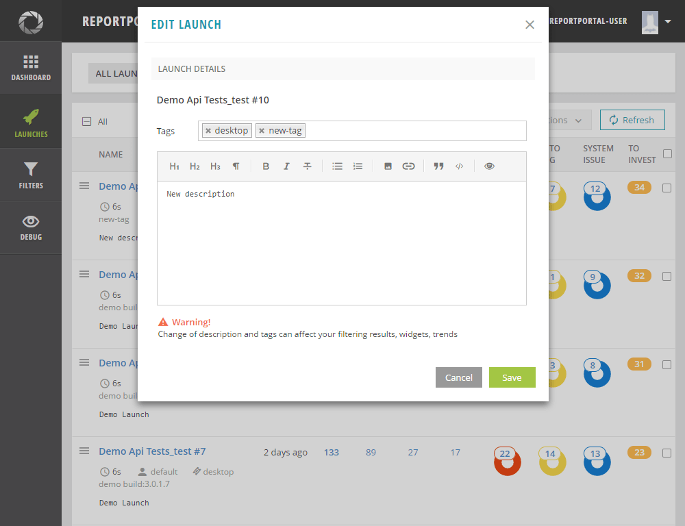
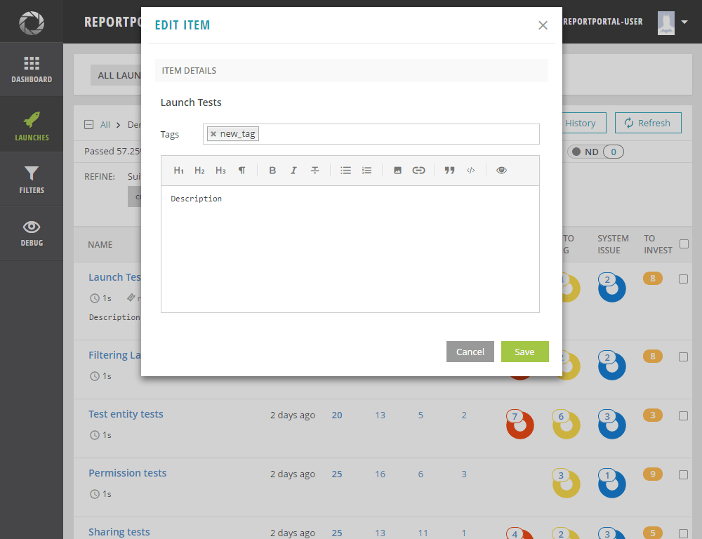
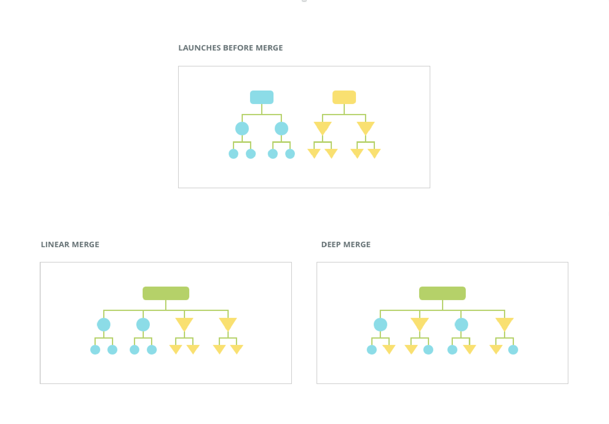
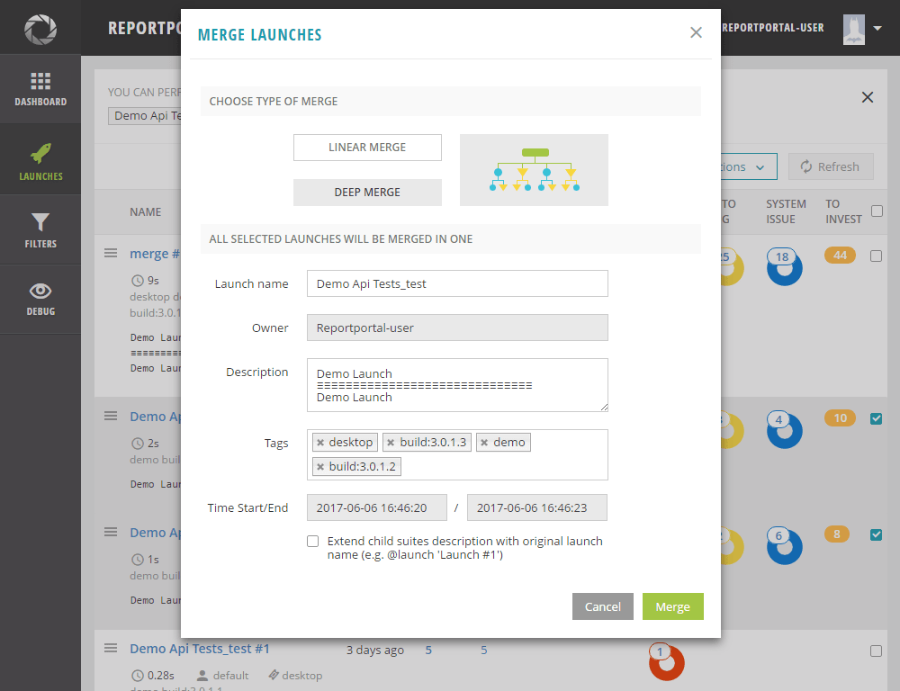
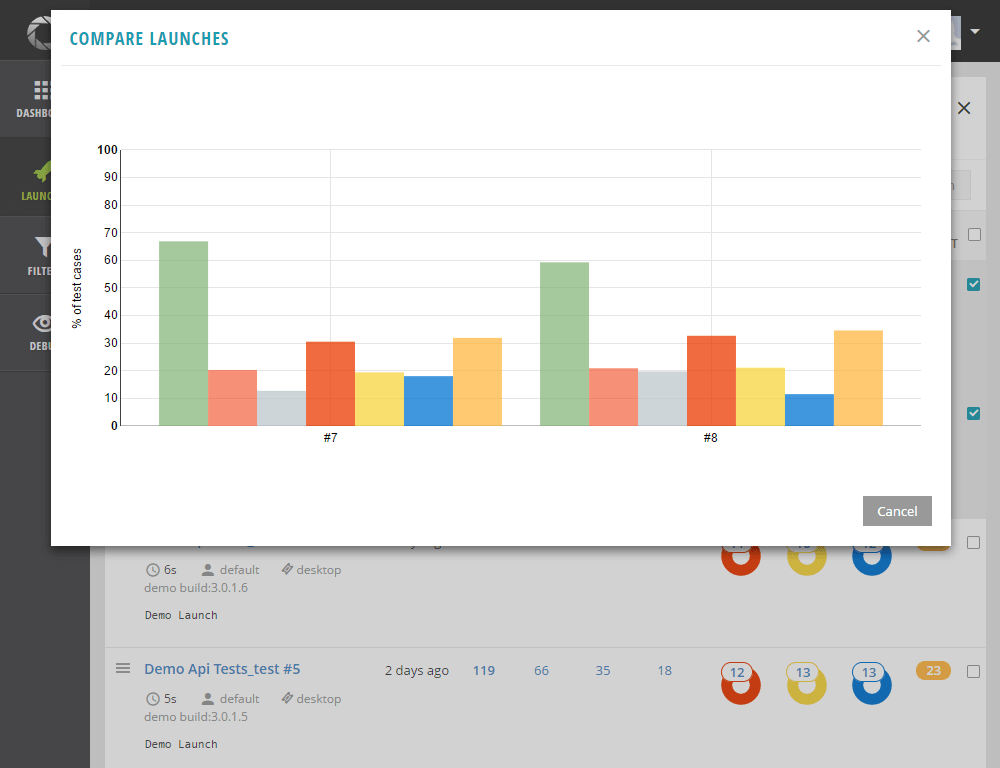
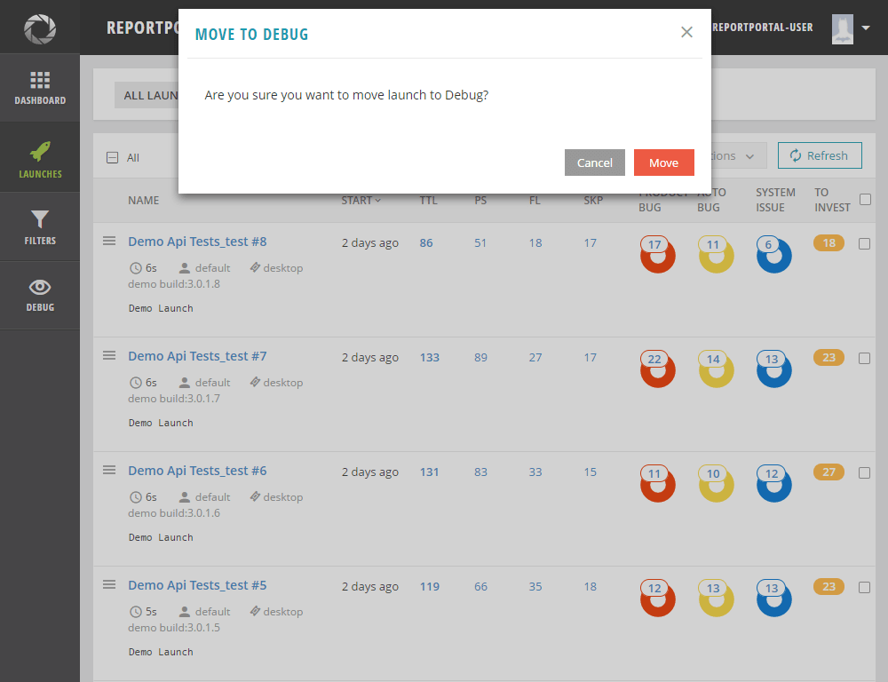
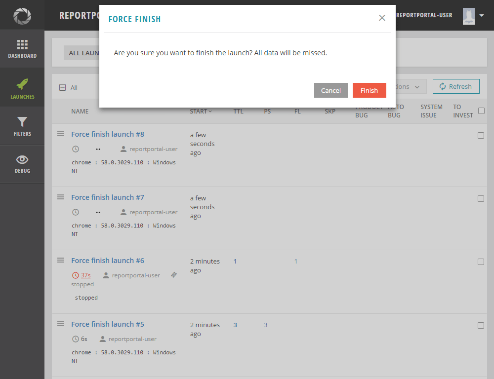
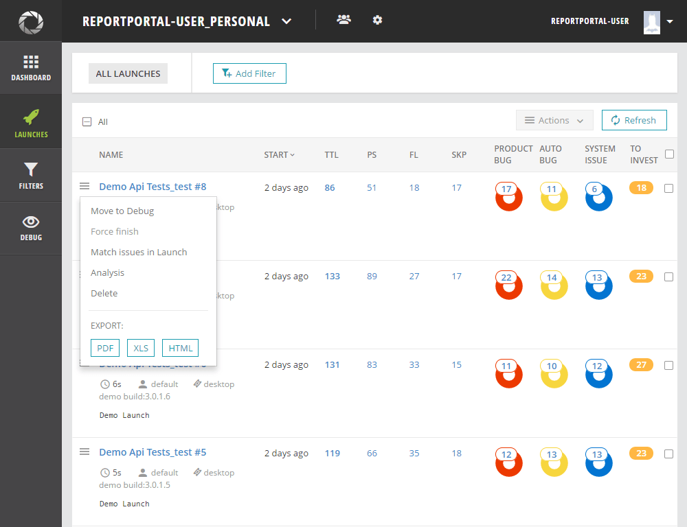
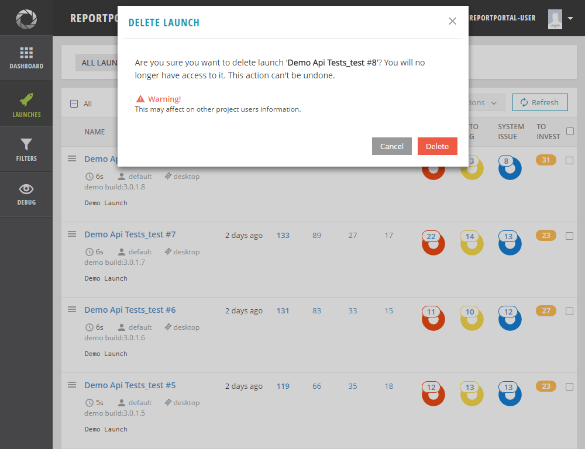
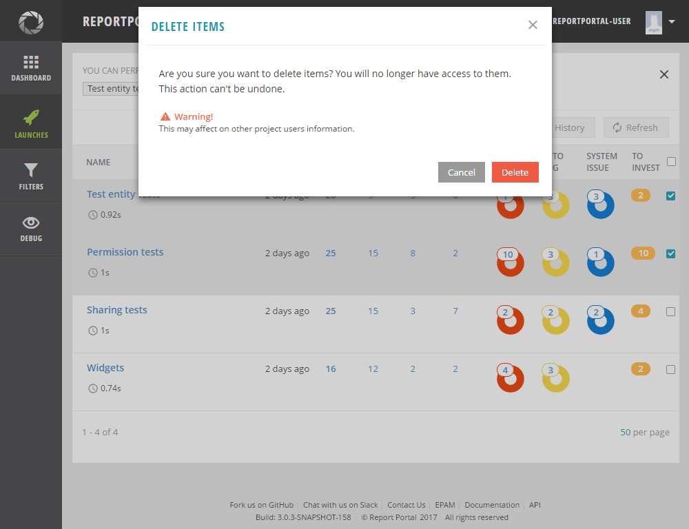

# Operations under launches

There are several ways of how launches could be modified and managed.

## Edit launch tags and description

The system allows editing tags and descriptions for the launch on the "Launches" and "Debug" modes.

Permission: next users are able to modify launches:

- Administrator

- User with one of Project Role {PROJECT MANAGER, LEAD} on the project

- User with one of Project Role {MEMBER, CUSTOMER} on the project - Launch Owner

In order to edit a launch, perform the following steps:

1. Navigate to the "Launches" page.

2. Select "Edit" option ('pencil' icon) to the selected launch.

3. The launch editor will be opened with the following options.

6. Make the required changes and click the "Save" button.

[](https://youtu.be/87dTCdsFD-I)

## Edit test item tags and description

The system allows to edit tags and description for the test items on the "Launches" and "Debug" pages.

Permission: next users are able to modify test items:

- Administrator

- User with one of Project Role {PROJECT MANAGER, LEAD} on the project

- User with one of Project Role {MEMBER, CUSTOMER} on the project - Launch Owner

In order to edit a test item, perform the following steps:

1. Navigate to the "Launches" page.

2. Drill down to the test level of any item.

3. Select the "Edit" option ('pencil' icon) to the selected test item.

4. The test item editor will be opened with the following options.

5. Make the required changes and click the "Save" button.

[](https://youtu.be/7PZIowd9III)

## Merge launches

Merge launches feature can help you to merge the existing launches into one.
If your project has a really huge number of regression suites and they cannot be in one particular launch, so, they divided into parts.
As soon as they completed, they could be merged in one separate launch to represent this data on dashboards and create reports.

Report Portal provides two options for merge: Linear and Deep. The difference in merge options is described below.

Basically, the merge models distinguished by the way of how the launches elements are collected in a resulting launch as shown on a picture:



**Linear merge**

In case the user selects the "Linear merge" option, the new launch is created. The new launch contains elements of merging launches.
Levels of elements stay the same as in origin launches. Status and issues statistics are calculated as the sum of statistics of all merged launches. The origin launches are deleted from the system.

**Deep merge**

In case the user selects the "Deep merge" option, the system creates a new launch and check items with the following conditions simultaneously:
* test items with the same names
* test items have the same type (SUITE or TEST) 
* test items are on the same path (number of parents) 
* test items with descendants. 
If such elements are found only the earliest one is added to the new launch. All descendants are collected on their levels as in the original launches. The merge is started from the upper levels to the lower levels. 
In case the upper level is not merged, the lower levels will not be merged as well. Items without descendants are not merged despite their level. 
Status and issues statistics are calculated for a new launch. 
The original launches are deleted from the system.

The Linear and Deep Merge algorithm, as described above, is shown on a scheme:


For instance, we have Launch-1 and Launch-2 to be merged. If system founds that Suite_A in Launch-1 and Suite_A in Launch-2 
have the same names and the same types and the same path and have descendants, so only the earliest Suite_A (according to start time) is added to the new launch. All descendants of merged suites are combined under the Suite_A. Then the system searches for the same matches on the next level (Test level).

If items are not met the conditions described for the "Deep Merge" option then they are collected the same 
way as described for the "Linear merge" option.

Permission: Next users are able to merge launches:

- Administrator

- User with one of Project Role {PROJECT MANAGER, LEAD} on the project

- User with one of Project Role {MEMBER, CUSTOMER} on the project - Launch Owner

In order to merge launches, perform the following steps:

1. Navigate to the "Launches" page.

2. Select required launches by click on their checkboxes.

3. Open 'Actions' list

4. Click the "Merge" button.

5. Merge launches popup will be opened. 

6. Select the merge type 'Linear Merge' or 'Deep Merge'

7. Parameters fields become active. Merge popup contains:
```javascript
                      Launch name: (editable)
                            Owner: The field is filled in with the current user.
                      Description: collect data from all launches 
                             Tags: collect unique tags from all launches
                   Time Start/End: filled in and disabled.
Checkbox 'Extend child suites description with original launches names': Unchecked by default
```
8. Make changes and click the "Merge" button on the "Merge Launches" window.
   After the merge, a new run will be shown on the common launches list.

>**Note:**
The following launches cannot be merged:
- Launches in progress
- Launches with active "Analysis" process
- Launches with active "Match issues in launch" process

[](https://youtu.be/tGTGFO0cGCM)

## Compare launches

Compare launches feature can help you to compare launches side by side to define differences between them.

Permissions: All users on the project

In order to compare launches, perform the following steps:

1. Navigate to the "Launches" page.

2. Select required launches by click on their checkboxes.

3. Expand the 'Actions' list

4. Select the "Compare" option.

5.  The system shows a window where a widget with bars is displayed, reflecting the
Passed/Failed/Skipped and Product Bug/Automation Bug/System Issue/To
Investigate test items.

>**Note:**
Launches can be compared on the 'Launches' page and not on the 'Debug' page.

[](https://youtu.be/1MjgTxbRH5c)

## Move launches to Debug

The "Debug" section is used to hide incorrect launches from the CUSTOMER view.

Permission: Next users are able to move launches to "Debug"/"Launches" mode:

- Administrator

- User with one of Project Role {PROJECT MANAGER, LEAD}

- User with {MEMBER} Project Role  - Launch Owner

In order to move a launch to the "Debug" section, perform the following steps:

1. Navigate to the "Launches" page 

2. Select the "Move to Debug" option from the context menu on the left hand of the launch name.

3. The warning popup will be opened

4. Click the 'Move' button 

5. The launch gets to "Debug" page and removed from "Launches" page

To return the launch to the "Launches" section, navigate to the "Debug" section and select the
"Move to All Launches" from the context menu.

In order to move some launches to the "Debug" section simultaneously, perform the following steps:

1. Navigate to the "Launches" page

2. Select required launches by click on their checkboxes

3. Open 'Actions' list 

4. Select "Move to Debug" from the list 

5. The warning popup will be opened.

6. Confirm the action

7. The launches get to the "Debug" page and removed from the "Launches" page.

To return the launches to the "Launches" section, navigate to the "Debug" section, select them 
and select "Move to All Launches" from the 'Actions' list.

[](https://youtu.be/UW1oMNy1-qo)

## Force finish launches

The system allows finishing launches on the "Launches" and the "Debug" pages manually.

Permission: Next users are able to stop launches:

- Administrator

- User with one of Project Role {PROJECT MANAGER, LEAD} on the project

- User with one of Project Role {MEMBER, CUSTOMER} on the project - Launch Owner

In order to finish a launch that is in progress now, perform the following steps:

1. Navigate to the "Launches" page.

2. Select the "Force Finish" option in the context menu on the left hand of the launch name.

3. The warning popup will be opened.

4. Click the "Finish" button.

5. The launch will be stopped and shown in the launches table with the "stopped" tag and the *"stopped"* description. All the statistics collected by this time will be displayed.

[](https://youtu.be/nI1u4ZvKX1Y)

In order to finish some launches simultaneously those are in progress now, perform the following steps:

1. Navigate to the "Launches" page.

2. Select required launches that are in progress by click on their checkboxes

3. Open 'Actions' list 

4. Select "Force Finish" from the list

5. The warning popup will be opened.

6. Confirm the action

7. All selected launches will be stopped and shown in the launches table with the "stopped" tag and
the *"stopped"* description. All the statistics collected by this time will be displayed.

## Export launches reports

The system allows exporting launches reports on the "Launches" and the "Debug"
modes. You can export the launch report in the following formats: PDF, XML, HTML.

In order to export a launch, perform the following steps:

1. Navigate to the "Launches" page.

2. Select the required format from the "Export" option in the context menu on the left hand of the launch name.

3. The launch report in the selected format will be opened.

[](https://youtu.be/NZIolEFI7zc)

>**Note:**
The export operation works for a separate launch only. No multiple actions for the export of launches.

## Delete launches

The system allows deleting launches on the "Launches" and "Debug" pages.

Permission: next users are able to delete launches:

- Administrator

- User with one of Project Role {PROJECT MANAGER, LEAD} on the project

- User with one of Project Role {MEMBER, CUSTOMER} on the project - Launch Owner

There are two ways how the launch/es can be deleted

In order to delete a launch, perform the following steps:

1. Navigate to the "Launches" page.

2. Select the "Delete" option in the context menu on the left hand of the launch name.

3. The warning popup will be opened.

4. Click the "Delete" button.

5.  The launch will be deleted from Report Portal. All related content will be deleted: test items, logs, screenshots.

[](https://youtu.be/DNy9aqPz3NQ)

In order to delete more than one launch simultaneously, perform the following steps:

1. Navigate to the "Launches" page

2. Select required launches by click on their checkboxes

3. Open 'Actions' list

4. Click 'Delete' option

5. The warning popup will be opened.

6. Confirm the action

7. The launches will be deleted from Report Portal. All related content will be deleted: test items, logs, screenshots.

>**Note:**
It is impossible to delete launches IN PROGRESS - "Delete" launch option will be disabled.
 
## Delete test item

The system allows deleting test items in all levels of launch in the "Launches" and "Debug" pages.

Permission: Next users are able to delete the test item:

- Administrator

- User with one of Project Role {PROJECT MANAGER, LEAD} on the project

- User with one of Project Role {MEMBER, CUSTOMER} on the project - Launch Owner

In order to delete a test item, perform the following steps:

1. Navigate to the "Launches" page

2. Drill down to the test level of any item

3. Select the "Delete" option in the context menu next to the selected test item.

4. The warning popup will be opened.

5. Click the "Delete" button.

6. The test item will be deleted from Report Portal with all related content (logs, screenshots).

[](https://youtu.be/r2r5OHwVt-U)

In order to delete some test items simultaneously, perform the following steps:

1. Navigate to the "Launches" page

2. Drill down to the test level of any item

3. Select required test items by click on their checkboxes

4. If you are on SUITE or TEST view, click 'Delete' button from the header

   If you are on STEP view, open 'Actions' list and select "Delete" option

5. The warning popup will be opened.

6. Confirm the action

7. Test items will be deleted from Report Portal with all related content (logs, screenshots).

>**Note:**
It is impossible to delete test items in launches IN PROGRESS - "Delete" test item option is disabled for test items in launches IN PROGRESS.
